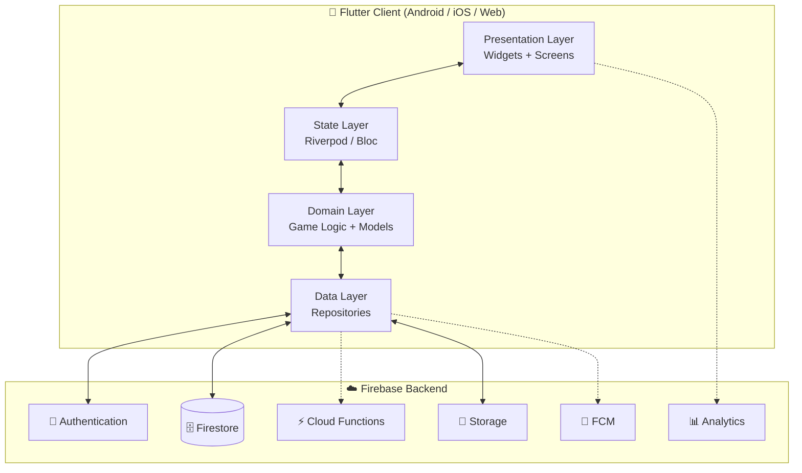
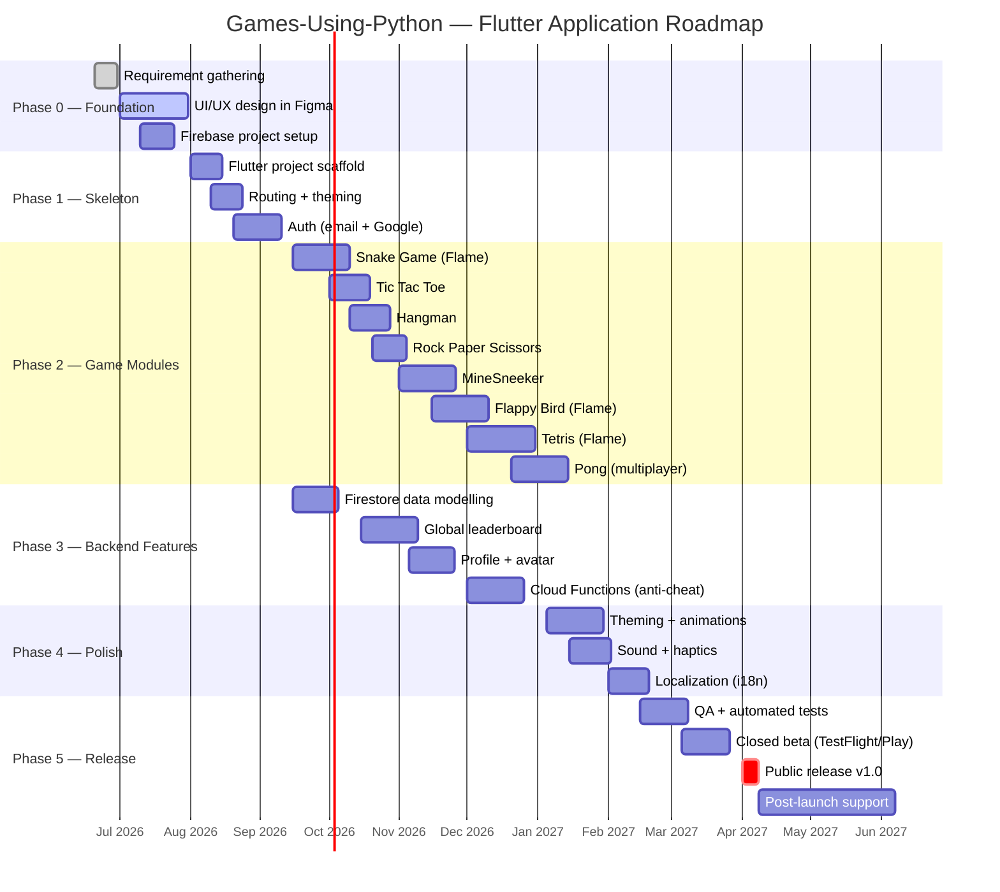
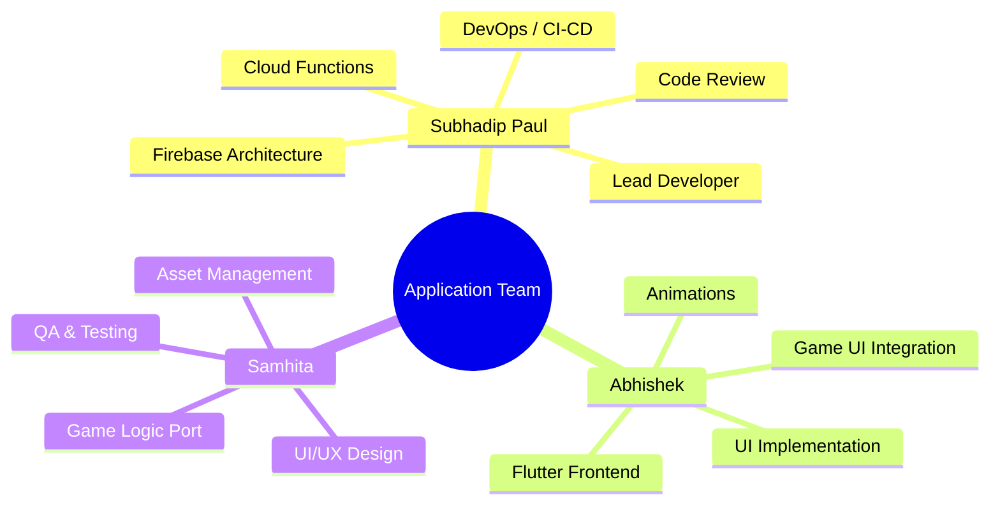
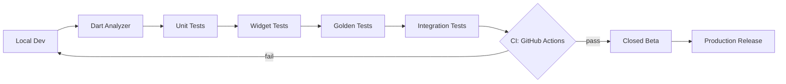

# 📱 Games Platform — Application Development

<p align="center">
  
  
  
  
  
  
</p>

<p align="center">
  <strong>The official roadmap for transforming the Python game collection into a unified cross-platform application using <em>Flutter</em> &amp; <em>Firebase</em>.</strong>
</p>

> 📌 This file documents the **Application** layer of the project.
> For the underlying Python game prototypes, see the [main README](./README.md).

---

## 🎯 Mission

Re-build the existing Python game prototypes (Snake, Tetris, Flappy Bird, Hangman, MineSneeker, Rock Paper Scissors, Tic Tac Toe, Pong) as **one polished cross-platform application** that runs on **Android, iOS and the Web** from a single Flutter codebase, backed by **Firebase** for authentication, real-time leaderboards, profiles and cloud sync.

```text
┌──────────────────────────────────────────────────────────────────┐
│                                                                  │
│   Python Prototypes  ──►  Flutter App  ──►  Firebase Backend     │
│   (logic reference)       (UI + Logic)      (Auth + DB + Funcs)  │
│                                                                  │
│                ▼                ▼                ▼               │
│            Android           iOS / Web        Real-time          │
│                                              Leaderboards        │
└──────────────────────────────────────────────────────────────────┘
```

---

## 🧰 Tech Stack & Tools

### 🧑‍💻 Core Languages & Frameworks

| Layer | Technology | Purpose |
|-------|------------|---------|
| **Frontend** | Flutter 3.x | Cross-platform UI (Android / iOS / Web) |
| **Language** | Dart 3.x | Application logic |
| **State Management** | Riverpod / Bloc | Predictable state & dependency injection |
| **Animations** | Flame Engine, Rive, Lottie | Game rendering & micro-interactions |
| **Game Loop** | Flame 1.x | 2D game engine for Flutter |

### ☁️ Firebase Services

| Service | Purpose |
|---------|---------|
| 🔐 **Firebase Authentication** | Email / Google / Anonymous login |
| 🗄️ **Cloud Firestore** | Profiles, scores, match history, leaderboards |
| ⚡ **Cloud Functions** | Score validation, anti-cheat, daily challenges |
| 📁 **Firebase Storage** | Avatars, custom skins, downloadable assets |
| 📲 **Cloud Messaging (FCM)** | Push notifications & challenges |
| 📊 **Firebase Analytics** | User journeys & retention |
| 🐞 **Crashlytics** | Real-time crash reporting |
| 🌐 **Firebase Hosting** | Web build deployment |
| 🧪 **Remote Config** | Feature flags, A/B testing |

### 🛠️ Dev & Ops Tooling

| Tool | Use |
|------|-----|
| **Android Studio / VS Code** | IDE + Flutter plugins |
| **Figma** | UI/UX design & prototyping |
| **GitHub + GitHub Actions** | Version control & CI/CD |
| **Codemagic / Fastlane** | Automated builds & store publishing |
| **Postman** | Cloud Function endpoint testing |
| **Sentry / Crashlytics** | Error monitoring |
| **Jira / GitHub Projects** | Task tracking |
| **Discord / Slack** | Team communication |

---

## 🏗️ Application Architecture



### Clean Architecture Layers

```text
lib/
├── core/                # constants, themes, utils, routing
├── data/                # Firebase repositories & DTOs
├── domain/              # entities, use-cases, abstract repos
├── presentation/        # screens, widgets, controllers
│   ├── auth/
│   ├── home/
│   ├── games/
│   │   ├── snake/
│   │   ├── tetris/
│   │   ├── flappy/
│   │   ├── hangman/
│   │   ├── minesweeper/
│   │   ├── rps/
│   │   ├── tic_tac_toe/
│   │   └── pong/
│   ├── leaderboard/
│   └── profile/
└── main.dart
```

---

## 🗺️ Detailed Roadmap



### Phase-by-Phase Breakdown

#### 🟣 Phase 0 — Foundation & Design *(June – July 2026)*
- Define MVP scope & user personas
- Wireframe every screen in **Figma** (low-fi → hi-fi)
- Build the **design system**: colors, typography, spacing, components
- Create the **Firebase project**, enable Auth + Firestore + Storage
- Lock the **app name**, logo and store presence

#### 🔵 Phase 1 — Skeleton *(August 2026)*
- `flutter create` with null-safety & sound migration
- Configure flavors (dev / staging / prod)
- Set up routing (`go_router`), theming (light / dark), L10n bootstrap
- Implement Auth screens (Sign-in, Sign-up, Forgot password, Anonymous)
- Wire Firebase SDK + secure config via `flutter_dotenv`

#### 🟢 Phase 2 — Game Modules *(September – December 2026)*
Each game is its own Flutter package under `lib/presentation/games/<name>/` with:
- Game state machine
- Flame component tree (for arcade games) or plain widgets (for board games)
- Per-game settings, controls, tutorial
- Local high score + Firestore sync hook

#### 🟡 Phase 3 — Backend Features *(September – December 2026, parallel)*
- Firestore schema: `users`, `scores`, `matches`, `daily_challenges`
- Security rules with unit tests via `@firebase/rules-unit-testing`
- Real-time leaderboard with pagination
- Cloud Functions for score validation & anti-cheat
- Daily / weekly challenge generator

#### 🟠 Phase 4 — Polish *(January – February 2027)*
- Implicit & hero animations
- Sound (Just Audio) + haptic feedback
- Accessibility (semantics, contrast, font scaling)
- Localization (English + Hindi + Bengali to start)
- Performance pass: tree shaking, lazy routes, image caching

#### 🔴 Phase 5 — Release *(February – April 2027)*
- Unit, widget, golden & integration tests (target ≥ 70% coverage)
- Closed beta via **TestFlight** & **Play Console internal track**
- Crashlytics & Analytics dashboards reviewed weekly
- Submission to **Play Store**, **App Store**, **Web** (Firebase Hosting)
- Post-launch: weekly patches, feature flags via Remote Config

---

## 👥 Team & Task Division



### 🧑‍✈️ Subhadip Paul — *Lead Developer & Backend Engineer*

> **Focus:** architecture, Firebase, infrastructure, code review.

| Area | Responsibilities |
|------|------------------|
| 🏗️ Architecture | Define clean-architecture layers, repositories, dependency graph |
| 🔐 Firebase Backend | Configure Auth providers, Firestore schema, security rules |
| ⚡ Cloud Functions | Score validation, leaderboard aggregation, daily challenges |
| 🚀 DevOps | GitHub Actions, build flavors, signing, Codemagic/Fastlane |
| 📈 Monitoring | Crashlytics, Analytics, Remote Config |
| 🧪 Backend Tests | Firestore rules tests, Functions emulator tests |
| 👀 Code Review | Final approver on all PRs touching `data/` & `domain/` |

**Key deliverables**
- ✅ Firebase project + security rules
- ✅ `data/` & `domain/` layers fully implemented
- ✅ CI/CD pipeline with automated APK + Web build
- ✅ Cloud Functions deployed & monitored

---

### 🎨 Abhishek — *Flutter Frontend Engineer*

> **Focus:** screens, widgets, navigation, game UI shell.

| Area | Responsibilities |
|------|------------------|
| 🖼️ Presentation Layer | Build every screen from Figma to pixel-perfect Flutter |
| 🎬 Animations | Hero transitions, micro-interactions, Lottie / Rive |
| 🧭 Navigation | `go_router` setup, deep links, route guards |
| 🎮 Game UI Shell | Wrappers, HUDs, pause / game-over overlays |
| 🌗 Theming | Light / dark mode, dynamic theming |
| 🧩 Reusable Widgets | Buttons, cards, dialogs, leaderboards |
| 📱 Responsive Design | Phone, tablet & web breakpoints |

**Key deliverables**
- ✅ Auth flow screens
- ✅ Home, Profile, Leaderboard, Settings screens
- ✅ Reusable widget library
- ✅ Per-game UI shells (HUD, pause menu, scoreboard)

---

### 🧪 Samhita — *UI/UX Designer & QA Lead*

> **Focus:** design system, game logic porting, testing.

| Area | Responsibilities |
|------|------------------|
| ✏️ Design | Figma wireframes, mockups, prototypes, design system |
| 🖌️ Assets | Icons, splash, sprites, sound assets, store graphics |
| 🕹️ Game Logic Port | Translate Python game logic → Dart use-cases |
| 🌍 Localization | Manage translation files (EN / HI / BN) |
| 🐛 QA & Testing | Manual test plans, widget tests, golden tests, bug triage |
| 📦 Beta Coordination | TestFlight / Play internal track, gathering tester feedback |
| 📚 Documentation | User guide, FAQ, in-app onboarding copy |

**Key deliverables**
- ✅ Complete Figma design system
- ✅ Dart ports of all 8 game logics (pure Dart, no UI)
- ✅ Test suites for every game module
- ✅ Localization + accessibility audit

---

### 🤝 Shared Responsibilities

| Activity | Everyone |
|----------|---------|
| 🔁 Daily stand-ups (15 min) | ✅ |
| 📝 Sprint planning (every 2 weeks) | ✅ |
| 🧐 Code reviews (cross-team) | ✅ |
| 📚 Documentation upkeep | ✅ |
| 🐞 Bug bashing before release | ✅ |

---

## 🧪 Quality Strategy



- **Lint:** `flutter_lints` + custom rules
- **Format:** `dart format` on pre-commit hook
- **Tests:** target ≥ 70% coverage across `domain/` & `data/`
- **CI:** every PR runs analyze + tests + build (Android + Web)
- **Beta:** Play Console internal + TestFlight before each release

---

## 🚀 Getting Started (for contributors)

```bash
# 1. Clone the repo
git clone https://github.com/Subhadip-Paul2006/Games-Using-Python.git
cd Games-Using-Python/app

# 2. Install Flutter (3.x) and verify
flutter doctor

# 3. Install dependencies
flutter pub get

# 4. Configure Firebase
flutterfire configure

# 5. Run on a connected device or emulator
flutter run

# 6. Run tests
flutter test
```

> 🔑 Ask **Subhadip** for the `dev` Firebase project access before running.

---

## 📦 Release Channels

| Channel | Audience | Trigger |
|---------|----------|---------|
| `dev` | Developers only | Every push to `develop` |
| `staging` | Internal team | Tagged `v*-beta` |
| `production` | Public | Tagged `v*` on `main` |

---

## 📜 License

This application is part of the **Games-Using-Python** project and is distributed under the **MIT License**. See [`LICENSE`](./LICENSE).

---

<p align="center">
  Crafted with 💙 by the <strong>Games-Using-Python Application Team</strong><br/>
  <a href="https://github.com/Subhadip-Paul2006">Subhadip Paul</a> · Abhishek · Samhita
</p>
