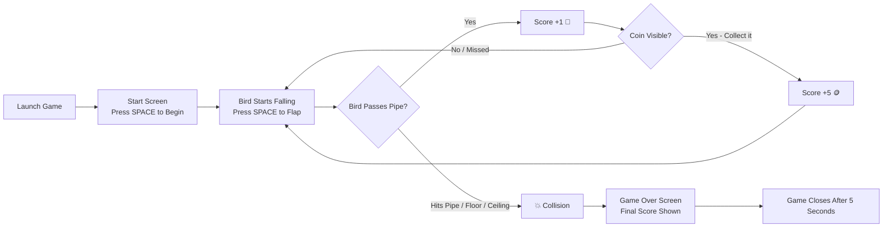

# 🐦 Flappy Bird Game (Python)

A fun and addictive **Flappy Bird clone** built with **Python and Pygame**.  
Navigate the bird through an endless stream of pipes, collect coins for bonus points, and see how high you can score!

---

## 📌 Project Status
✅ **Complete**

---

## 🎮 Game Description

The player controls a bird that continuously falls due to gravity.  
By pressing **SPACE**, the bird flaps its wings and gains upward momentum.  
The goal is to fly through the gaps between green pipes without crashing.  
Bonus coins occasionally appear between pipes — collect them for **+5 points**!

The game ends when the bird hits a pipe, the ground, or the ceiling.  
Your final score is shown on screen and the game closes automatically after a few seconds.

---

## ✨ Features

- 🐦 Smooth bird wing animation (flapping up/down sprites)
- 🌥️ Animated scrolling clouds
- 🪙 Random coin spawns for bonus points (+5)
- 🔊 Sound effects for flapping, scoring, hitting, and dying
- 💥 Collision detection with pipes, floor, and ceiling
- 📊 Live score display
- 🎬 Start screen and Game Over screen

---

## 🎯 Controls

| Action | Input |
|--------|-------|
| Start the game | `SPACE` |
| Flap / fly upward | `SPACE` |
| Quit the game | Close the window |

> ⚠️ After a game over, the game automatically closes after **5 seconds**.

---

## 🔄 User Flow



---

## 🏗 Architecture Overview

The project follows a single-file game loop structure.

**Main Components:**

1️⃣ **Game State Management**
- `game_started` — whether gameplay has begun
- `game_over` — whether the player has died

2️⃣ **Physics & Movement**
- Gravity applied to the bird every frame
- `SPACE` applies an upward velocity impulse

3️⃣ **Pipe System**
- Pipes scroll left at a fixed speed
- Randomised gap heights each cycle
- Score increments when the bird clears a pipe

4️⃣ **Coin System**
- 80% chance to spawn a coin after each pipe
- Coin moves at the same speed as the pipes
- Collecting a coin awards **+5 points**

5️⃣ **Rendering**
- Animated clouds, bird sprites (up/down wings), pipes, coins, and score text
- Start and Game Over overlays

6️⃣ **Sound System**
- Distinct sounds for flapping, scoring, hitting, and dying

---

## 📂 Folder Architecture

```bash
Flappy Bird/
│
├── Flappy_Bird.py       # Main game loop and all game logic
├── Test1.py             # Development / testing script
├── requirements.txt     # Python dependencies
├── README.md            # This file
│
├── flappy_up.png        # Bird sprite — wings up
├── flappy_down.png      # Bird sprite — wings down
├── coin.png             # Coin sprite (bonus collectible)
│
├── flap.wav             # Wing flap sound
├── point.wav            # Score point sound
├── hit.wav              # Collision / hit sound
├── die.wav              # Death sound
└── swoosh.wav           # Game start whoosh sound
```

---

## ⚙️ Requirements

- **Python 3.8+**
- **Pygame** library

---

## ▶️ How to Run the Game

1️⃣ Navigate to the game folder

```bash
cd "Flappy Bird"
```

2️⃣ Install dependencies

```bash
pip install -r requirements.txt
```

3️⃣ Run the game

```bash
python Flappy_Bird.py
```

> 💡 Make sure all asset files (`.png`, `.wav`) are in the **same directory** as `Flappy_Bird.py`.

---

## 💡 Future Improvements

- 🏆 High-score saving between sessions
- 🔁 Restart without closing the game
- 🎨 Animated background (day / night cycle)
- 📈 Progressive difficulty (pipes speed up over time)
- 🖱️ Mouse click / touch support for flapping

---

## 👨‍💻 Contributors

Developed with 💙 by:

- **Abhishek Dutta**
- **Samhita Mondal**
- **EnrGHacker**
