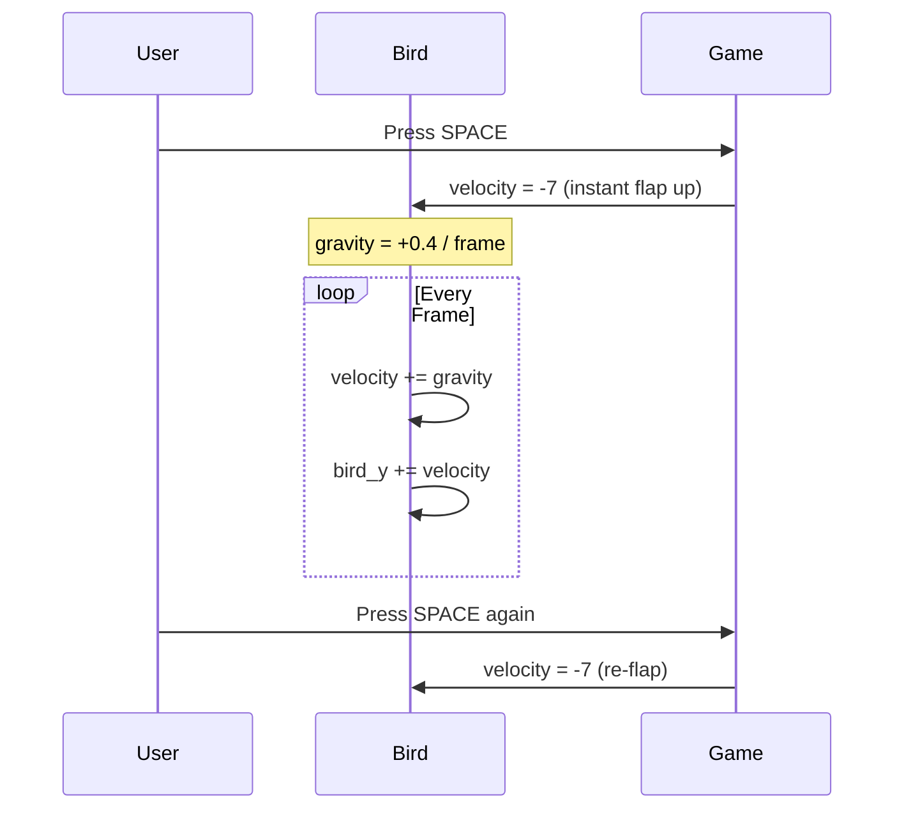
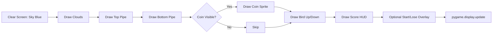
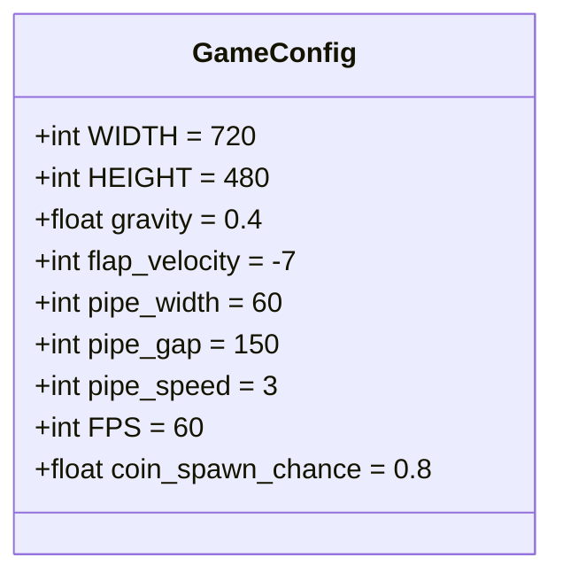
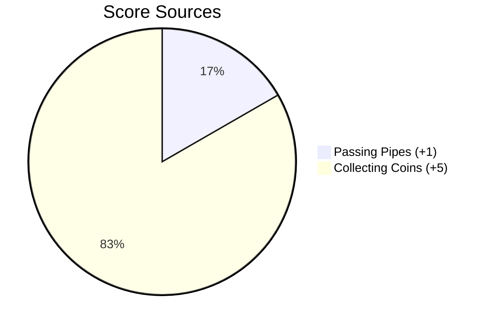
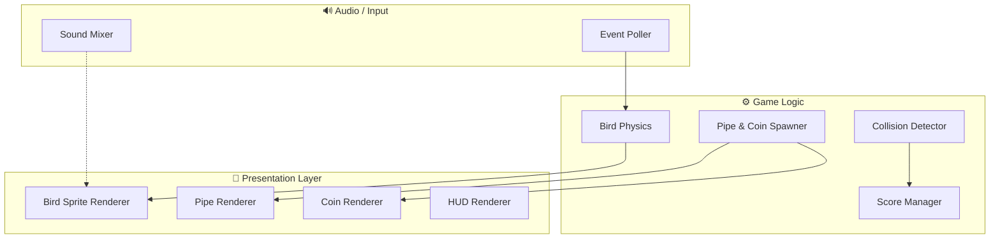
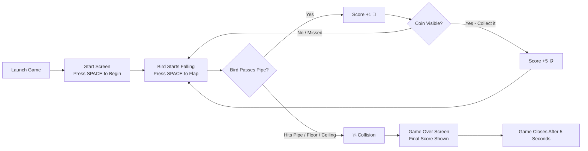

# 🐦 Flappy Bird Game (Python)

<<<<<<< HEAD
<p align="center">
  
  
  
</p>

A simple **Flappy Bird clone** built using **Python and Pygame** — with smooth animations, coin pickups, multiple sound effects, and authentic one-tap physics.

---

## 🎮 What is Flappy Bird?

> Tap **SPACE** to flap. Navigate the bird through endless pipes without crashing. Collect coins between pipes for bonus points. Survive as long as possible to set a new high score.

---

## 🌟 Features

- 🐤 Smooth bird flapping animation (wing up / wing down state)
- 🎵 Five distinct sound effects (flap, point, hit, die, swoosh)
- 💥 Pixel-perfect collision detection
- 🪙 Random coin pickups worth **+5 points**
- ☁️ Parallax-scrolling clouds
- 🚧 Procedurally generated pipe heights
- 📈 Real-time score tracking
- 🎮 Classic Flappy Bird one-tap mechanics

---

## 🕹️ Game Loop Overview


```mermaid
flowchart TD
    Start([🚀 Start Game]) --> Init[Initialize PyGame + Load Sounds/Sprites]
    Init --> Idle{Bird Idle on Start Screen?}
    Idle -- "Press SPACE" --> Play[Begin Gameplay]
    Play --> Gravity[Apply Gravity + Move Pipes Left]
    Gravity --> Collide{Collision with Pipe / Floor / Ceiling?}
    Collide -- "Yes" --> Death[Play Hit + Die Sound]
    Death --> Over[Show YOU LOSE + Final Score]
    Over --> Wait[Wait 5 seconds]
    Wait --> Exit([❌ Exit Process])

    Collide -- "No" --> Coin{Coin Collision?}
    Coin -- "Yes" --> Score[+5 Bonus, Hide Coin]
    Coin -- "No" --> Pass{Passed Pipe?}
    Pass -- "Yes" --> AddScore[+1 Score, Play Point Sound]
    Pass -- "No" --> Render
    Score --> Render[Render Frame]
    AddScore --> Render
    Render --> Gravity
```

---

## 🐦 Bird Physics


```mermaid
sequenceDiagram
    participant User
    participant Bird
    participant Game

    User->>Game: Press SPACE
    Game->>Bird: velocity = -7  (instant flap up)
    Note over Bird: gravity = +0.4 / frame

    loop Every Frame
        Bird->>Bird: velocity += gravity
        Bird->>Bird: bird_y += velocity
    end

    User->>Game: Press SPACE again
    Game->>Bird: velocity = -7  (re-flap)
```

---

## 🌐 World Rendering Pipeline


```mermaid
flowchart LR
    A[Clear Screen: Sky Blue] --> B[Draw Clouds]
    B --> C[Draw Top Pipe]
    C --> D[Draw Bottom Pipe]
    D --> E{Coin Visible?}
    E -- Yes --> F[Draw Coin Sprite]
    E -- No --> G[Skip]
    F --> H[Draw Bird Up/Down]
    G --> H
    H --> I[Draw Score HUD]
    I --> J[Optional Start/Lose Overlay]
    J --> K[pygame.display.update]
```
=======
A fun and addictive **Flappy Bird clone** built with **Python and Pygame**.  
Navigate the bird through an endless stream of pipes, collect coins for bonus points, and see how high you can score!

---

## 📌 Project Status
✅ **Complete**
>>>>>>> 10c6cd1ab7414573c76a973de62db78ef1919acf

---

## 🎮 Game Description

<<<<<<< HEAD
| File | Purpose |
|------|---------|
| `Flappy_Bird.py` | 🎮 Main game file — full game loop |
| `Test1.py` | 🧪 Experimental / prototype script |
| `flappy_up.png` | 🐤 Bird sprite (wings up) |
| `flappy_down.png` | 🐤 Bird sprite (wings down) |
| `coin.png` | 🪙 Collectible coin sprite |
| `flap.wav` | 🔊 Wing flap sound |
| `point.wav` | 🔊 Score + coin pickup chime |
| `hit.wav` | 🔊 Collision impact |
| `die.wav` | 🔊 Game-over melody |
| `swoosh.wav` | 🔊 Start-screen transition |
| `requirements.txt` | 📦 Dependency list |

---

## 🗂️ Project Structure

```text
Flappy Bird/
│
├── Flappy_Bird.py        # 🎮 Main game file
├── Test1.py              # 🧪 Test / prototype file
│
├── flappy_up.png         # 🐤 Bird sprite — wings up
├── flappy_down.png       # 🐤 Bird sprite — wings down
├── coin.png              # 🪙 Coin sprite
│
├── flap.wav              # 🔊 Flap sound
├── point.wav             # 🔊 Point / coin sound
├── hit.wav               # 🔊 Hit pipe sound
├── die.wav               # 🔊 Death sound
├── swoosh.wav            # 🔊 Start swoosh
│
├── requirements.txt      # 📦 Dependencies
└── README.md             # 📖 You are here
```

---

## ⚙️ Game Constants


```mermaid
classDiagram
    class GameConfig {
        +int WIDTH = 720
        +int HEIGHT = 480
        +float gravity = 0.4
        +int flap_velocity = -7
        +int pipe_width = 60
        +int pipe_gap = 150
        +int pipe_speed = 3
        +int FPS = 60
        +float coin_spawn_chance = 0.8
    }
```
=======
The player controls a bird that continuously falls due to gravity.  
By pressing **SPACE**, the bird flaps its wings and gains upward momentum.  
The goal is to fly through the gaps between green pipes without crashing.  
Bonus coins occasionally appear between pipes — collect them for **+5 points**!

The game ends when the bird hits a pipe, the ground, or the ceiling.  
Your final score is shown on screen and the game closes automatically after a few seconds.
>>>>>>> 10c6cd1ab7414573c76a973de62db78ef1919acf

---

## ✨ Features

<<<<<<< HEAD
- 🐍 **Python 3.14** (or compatible 3.x)
- 🎮 **Pygame** library

```bash
pip install pygame
```
=======
- 🐦 Smooth bird wing animation (flapping up/down sprites)
- 🌥️ Animated scrolling clouds
- 🪙 Random coin spawns for bonus points (+5)
- 🔊 Sound effects for flapping, scoring, hitting, and dying
- 💥 Collision detection with pipes, floor, and ceiling
- 📊 Live score display
- 🎬 Start screen and Game Over screen
>>>>>>> 10c6cd1ab7414573c76a973de62db78ef1919acf

---

## 🎯 Controls

<<<<<<< HEAD
1. 📂 Navigate to the **Flappy Bird** folder.
2. 📦 Install pygame:
   ```bash
   pip install pygame
   ```
3. 🚀 Launch the game:
   ```bash
   python Flappy_Bird.py
   ```

---

## 🎮 Controls

| Action | Key |
|--------|-----|
| 🪶 Flap (Start / Jump) | <kbd>Space</kbd> |
| ❌ Quit (close window) | Window close button |

---

## 📊 Scoring Rules


```mermaid
pie title Score Sources
    "Passing Pipes (+1)" : 1
    "Collecting Coins (+5)" : 5
```

| Event | Points |
|-------|:------:|
| Pass a pipe | **+1** |
| Collect a coin | **+5** |
| Collide | **Game Over** |

---

## 🧩 Architecture Layers


```mermaid
flowchart TB
    subgraph Presentation["🎨 Presentation Layer"]
        BirdSprite[Bird Sprite Renderer]
        PipeRenderer[Pipe Renderer]
        CoinRenderer[Coin Renderer]
        HUDRenderer[HUD Renderer]
    end

    subgraph Logic["⚙️ Game Logic"]
        Physics[Bird Physics]
        Spawner[Pipe & Coin Spawner]
        Collision[Collision Detector]
        ScoreManager[Score Manager]
    end

    subgraph IO["🔊 Audio / Input"]
        SoundEngine[Sound Mixer]
        EventLoop[Event Poller]
    end

    Physics --> BirdSprite
    Spawner --> PipeRenderer
    Spawner --> CoinRenderer
    Collision --> ScoreManager
    EventLoop --> Physics
    SoundEngine -.-> BirdSprite
```

---

## 🔮 Future Improvements

- 🏆 Persistent high-score saving (JSON or DB)
- 🌈 Day / night cycle
- 🎨 Multiple bird skins
- 🚧 Difficulty modes (pipe speed, gap size)
- 📱 Touch / mobile input support
=======
| Action | Input |
|--------|-------|
| Start the game | `SPACE` |
| Flap / fly upward | `SPACE` |
| Quit the game | Close the window |

> ⚠️ After a game over, the game automatically closes after **5 seconds**.

---

## 🔄 User Flow


```mermaid
flowchart LR

A[Launch Game] --> B[Start Screen\nPress SPACE to Begin]
B --> C[Bird Starts Falling\nPress SPACE to Flap]

C --> D{Bird Passes Pipe?}

D -->|Yes| E[Score +1 🎯]
E --> F{Coin Visible?}

F -->|Yes - Collect it| G[Score +5 🪙]
F -->|No / Missed| C

G --> C

D -->|Hits Pipe / Floor / Ceiling| H[💥 Collision]
H --> I[Game Over Screen\nFinal Score Shown]
I --> J[Game Closes After 5 Seconds]
```

---

## 🏗 Architecture Overview

The project follows a single-file game loop structure.

**Main Components:**

1️⃣ **Game State Management**
- `game_started` — whether gameplay has begun
- `game_over` — whether the player has died

2️⃣ **Physics & Movement**
- Gravity applied to the bird every frame
- `SPACE` applies an upward velocity impulse

3️⃣ **Pipe System**
- Pipes scroll left at a fixed speed
- Randomised gap heights each cycle
- Score increments when the bird clears a pipe

4️⃣ **Coin System**
- 80% chance to spawn a coin after each pipe
- Coin moves at the same speed as the pipes
- Collecting a coin awards **+5 points**

5️⃣ **Rendering**
- Animated clouds, bird sprites (up/down wings), pipes, coins, and score text
- Start and Game Over overlays

6️⃣ **Sound System**
- Distinct sounds for flapping, scoring, hitting, and dying

---

## 📂 Folder Architecture

```bash
Flappy Bird/
│
├── Flappy_Bird.py       # Main game loop and all game logic
├── Test1.py             # Development / testing script
├── requirements.txt     # Python dependencies
├── README.md            # This file
│
├── flappy_up.png        # Bird sprite — wings up
├── flappy_down.png      # Bird sprite — wings down
├── coin.png             # Coin sprite (bonus collectible)
│
├── flap.wav             # Wing flap sound
├── point.wav            # Score point sound
├── hit.wav              # Collision / hit sound
├── die.wav              # Death sound
└── swoosh.wav           # Game start whoosh sound
```

---

## ⚙️ Requirements

- **Python 3.8+**
- **Pygame** library

---

## ▶️ How to Run the Game

1️⃣ Navigate to the game folder

```bash
cd "Flappy Bird"
```

2️⃣ Install dependencies

```bash
pip install -r requirements.txt
```

3️⃣ Run the game

```bash
python Flappy_Bird.py
```

> 💡 Make sure all asset files (`.png`, `.wav`) are in the **same directory** as `Flappy_Bird.py`.

---

## 💡 Future Improvements

- 🏆 High-score saving between sessions
- 🔁 Restart without closing the game
- 🎨 Animated background (day / night cycle)
- 📈 Progressive difficulty (pipes speed up over time)
- 🖱️ Mouse click / touch support for flapping
>>>>>>> 10c6cd1ab7414573c76a973de62db78ef1919acf

---

## 👨‍💻 Contributors

<<<<<<< HEAD
- **Abhishek Dutta**
- **Samhita Mondal**

---

<p align="center">
  Made with ❤️ and a lot of <kbd>SPACE</kbd> presses.
</p>
=======
Developed with 💙 by:

- **Abhishek Dutta**
- **Samhita Mondal**
>>>>>>> 10c6cd1ab7414573c76a973de62db78ef1919acf
