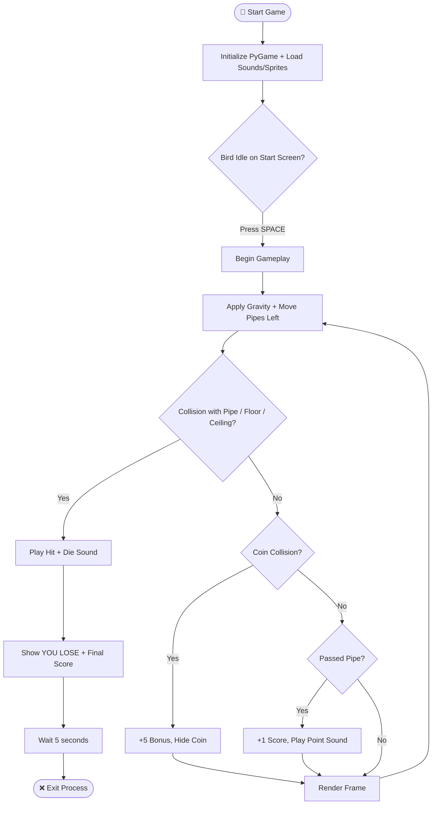
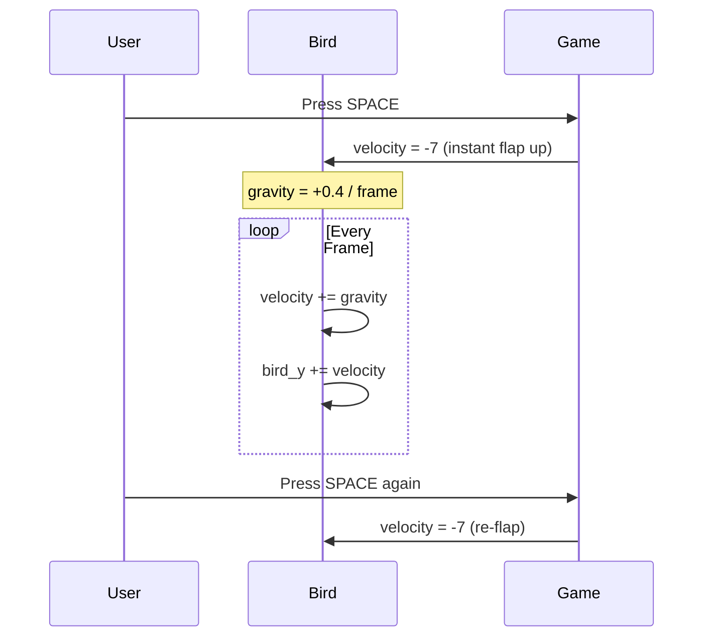
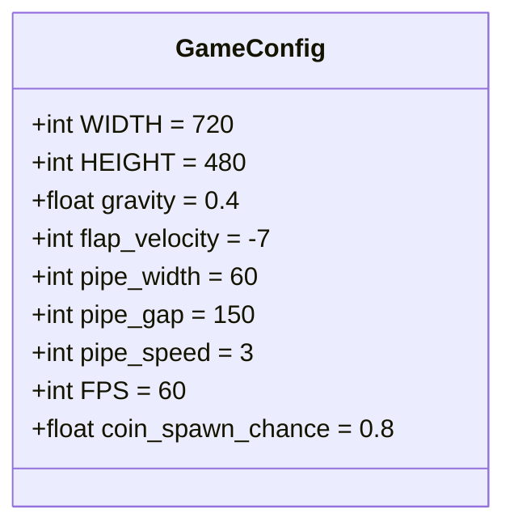
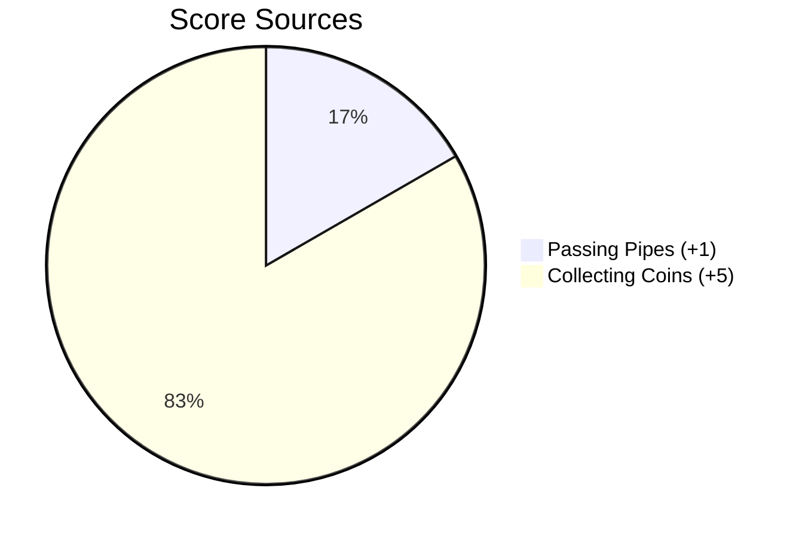
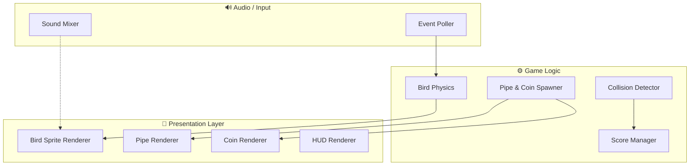

# 🐦 Flappy Bird Game (Python)

<p align="center">
  
  
  
</p>

A simple **Flappy Bird clone** built using **Python and Pygame** — with smooth animations, coin pickups, multiple sound effects, and authentic one-tap physics.

---

## 🎮 What is Flappy Bird?

> Tap **SPACE** to flap. Navigate the bird through endless pipes without crashing. Collect coins between pipes for bonus points. Survive as long as possible to set a new high score.

---

## 🌟 Features

- 🐤 Smooth bird flapping animation (wing up / wing down state)
- 🎵 Five distinct sound effects (flap, point, hit, die, swoosh)
- 💥 Pixel-perfect collision detection
- 🪙 Random coin pickups worth **+5 points**
- ☁️ Parallax-scrolling clouds
- 🚧 Procedurally generated pipe heights
- 📈 Real-time score tracking
- 🎮 Classic Flappy Bird one-tap mechanics

---

## 🕹️ Game Loop Overview


```mermaid
flowchart TD
    Start([🚀 Start Game]) --> Init[Initialize PyGame + Load Sounds/Sprites]
    Init --> Idle{Bird Idle on Start Screen?}
    Idle -- "Press SPACE" --> Play[Begin Gameplay]
    Play --> Gravity[Apply Gravity + Move Pipes Left]
    Gravity --> Collide{Collision with Pipe / Floor / Ceiling?}
    Collide -- "Yes" --> Death[Play Hit + Die Sound]
    Death --> Over[Show YOU LOSE + Final Score]
    Over --> Wait[Wait 5 seconds]
    Wait --> Exit([❌ Exit Process])

    Collide -- "No" --> Coin{Coin Collision?}
    Coin -- "Yes" --> Score[+5 Bonus, Hide Coin]
    Coin -- "No" --> Pass{Passed Pipe?}
    Pass -- "Yes" --> AddScore[+1 Score, Play Point Sound]
    Pass -- "No" --> Render
    Score --> Render[Render Frame]
    AddScore --> Render
    Render --> Gravity
```

---

## 🐦 Bird Physics


```mermaid
sequenceDiagram
    participant User
    participant Bird
    participant Game

    User->>Game: Press SPACE
    Game->>Bird: velocity = -7  (instant flap up)
    Note over Bird: gravity = +0.4 / frame

    loop Every Frame
        Bird->>Bird: velocity += gravity
        Bird->>Bird: bird_y += velocity
    end

    User->>Game: Press SPACE again
    Game->>Bird: velocity = -7  (re-flap)
```

---

## 🗂️ Project Structure

```text
Flappy Bird/
│
├── Flappy_Bird.py        # 🎮 Main game file — full game loop
├── assests/              # 🎨 Assets directory
│   ├── images/           # 🐤 Bird sprites (flappy_up.png, flappy_down.png) & coin sprite
│   └── sounds/           # 🔊 Sound effects (flap, point, hit, die, swoosh)
├── .env                  # 🔐 Environment variables
├── requirements.txt      # 📦 Python dependencies
└── README.md             # 📖 Game documentation
```

---

## ⚙️ Game Constants


```mermaid
classDiagram
    class GameConfig {
        +int WIDTH = 720
        +int HEIGHT = 480
        +float gravity = 0.4
        +int flap_velocity = -7
        +int pipe_width = 60
        +int pipe_gap = 150
        +int pipe_speed = 3
        +int FPS = 60
        +float coin_spawn_chance = 0.8
    }
```

---

## 🎮 Controls

| Action | Key |
|--------|-----|
| 🪶 Flap (Start / Jump) | <kbd>Space</kbd> |
| ❌ Quit (close window) | Window close button |

> ⚠️ After a game over, the game automatically closes after **5 seconds**.

---

## 📊 Scoring Rules


```mermaid
pie title Score Sources
    "Passing Pipes (+1)" : 1
    "Collecting Coins (+5)" : 5
```

| Event | Points |
|-------|:------:|
| Pass a pipe | **+1** |
| Collect a coin | **+5** |
| Collide | **Game Over** |

---

## 🧩 Architecture Layers


```mermaid
flowchart TB
    subgraph Presentation["🎨 Presentation Layer"]
        BirdSprite[Bird Sprite Renderer]
        PipeRenderer[Pipe Renderer]
        CoinRenderer[Coin Renderer]
        HUDRenderer[HUD Renderer]
    end

    subgraph Logic["⚙️ Game Logic"]
        Physics[Bird Physics]
        Spawner[Pipe & Coin Spawner]
        Collision[Collision Detector]
        ScoreManager[Score Manager]
    end

    subgraph IO["🔊 Audio / Input"]
        SoundEngine[Sound Mixer]
        EventLoop[Event Poller]
    end

    Physics --> BirdSprite
    Spawner --> PipeRenderer
    Spawner --> CoinRenderer
    Collision --> ScoreManager
    EventLoop --> Physics
    SoundEngine -.-> BirdSprite
```

---

## ▶️ How to Run the Game

1️⃣ Navigate to the game folder:
```bash
cd "Flappy Bird"
```

2️⃣ Install dependencies:
```bash
pip install -r requirements.txt
```

3️⃣ Run the game:
```bash
python Flappy_Bird.py
```

---

## 🔮 Future Improvements

- 🏆 Persistent high-score saving (JSON or DB)
- rainbow Day / night cycle
- 🎨 Multiple bird skins
- 🚧 Difficulty modes (pipe speed, gap size)
- 📱 Touch / mobile input support

---

## 👨‍💻 Contributors

- **Abhishek Dutta**
- **Samhita Mondal**

---

<p align="center">
  Made with ❤️ and a lot of <kbd>SPACE</kbd> presses.
</p>
