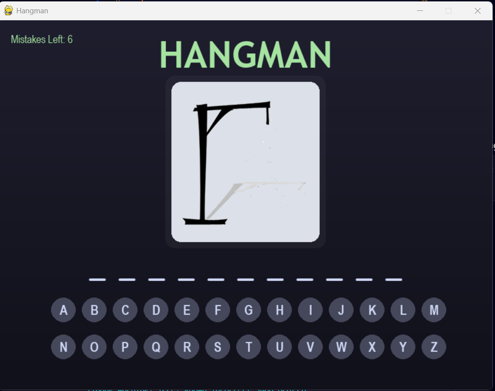
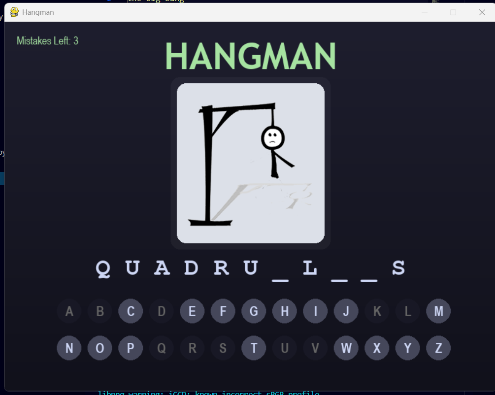
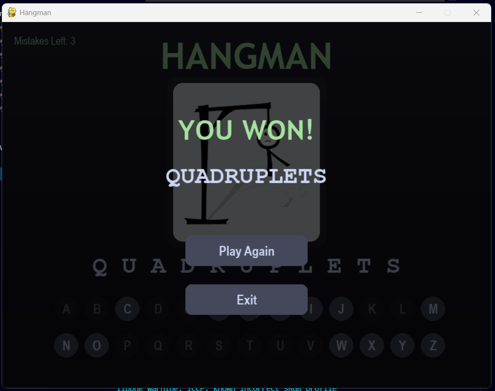
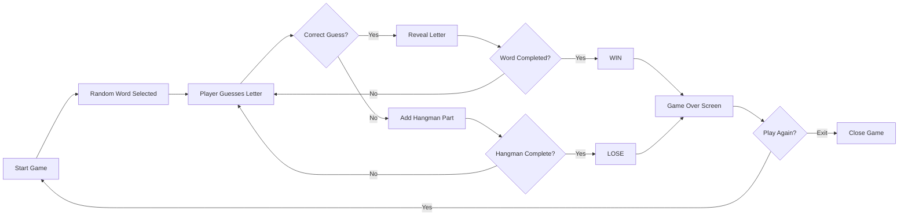

# 🎮 Hangman Game (Pygame)

A modern and interactive **Hangman Game built using Python and Pygame**.  
The game challenges players to guess a hidden word by selecting letters before the hangman is fully drawn.

This project focuses on **clean UI, keyboard interaction, sound feedback, and structured game architecture**, making it a polished mini-game built with Python.

---

## 🖼 Demo

<div align="center">

<b>Start Screen</b><br>


<b>Gameplay</b><br>


<b>Game Result</b><br>


</div>

---

## 🧠 Game Concept

Hangman is a classic word guessing game where:

- A **hidden word** is selected randomly.
- The player guesses letters from **A–Z**.
- Each incorrect guess adds a **new part of the hangman drawing**.
- If the drawing completes before the word is guessed → **Game Over**.
- If the player reveals the full word → **You Win**.

---

## 🚀 Features

- 🎮 Interactive **Hangman gameplay**
- ⌨ **Keyboard input support (A–Z)**
- 🖱 **Clickable alphabet buttons**
- 🖼 Progressive **hangman image rendering**
- 🔊 Sound effects for:
  - Correct guess
  - Wrong guess
  - Win
  - Lose
- 🎨 Modern **dark themed UI**
- 🔄 **Play Again** option
- ❌ **Exit button**
- 🧩 Clean and modular code structure

---

## 🔄 User Flow


---

## 🏗 Architecture Overview

The project is structured to separate **game logic, rendering, and assets**.

Main Components:

1️⃣ **Game Logic**
- Word selection
- Guess validation
- Win / Lose detection

2️⃣ **Rendering System**
- Background drawing
- Hangman stage rendering
- Word display
- Alphabet buttons

3️⃣ **Input Handling**
- Mouse clicks
- Keyboard input (A–Z)

4️⃣ **Game State Management**
- Start Screen
- Gameplay
- Game Over Screen

---

## 📂 Project Structure

```bash
Hangman/
│
├── main.py # Main game logic and rendering
├── words.txt # Word dataset used for random selection
├── test_randomWord.py # Testing script for word selection
│
├── hangman0.png # Hangman stage images
├── hangman1.png
├── hangman2.png
├── hangman3.png
├── hangman4.png
├── hangman5.png
├── hangman6.png
│
├── Correct.wav # Correct guess sound
├── Wrong.wav # Wrong guess sound
├── Win.wav # Win sound
├── Loose.wav # Lose sound
│
├── generate_sounds.py # Optional script for sound generation
│
├── demo01.png # Start screen demo
├── demo02.png # Gameplay demo
├── demo03.png # Game result demo
```

---

## ⚙ Requirements

Make sure you have **Python 3.8+** installed.

Install Pygame:

```bash
pip install pygame
```

---

## ▶ How to Run the Game

1️⃣ Clone the repository

```bash
git clone https://github.com/your-username/hangman-game.git
```

2️⃣ Navigate to the project folder

```bash
cd hangman-game
```

3️⃣ Install dependencies

```bash
pip install pygame
```

4️⃣ Run the game

```bash
python main.py
```

---

## 🎮 Controls

| Action | Input |
|------|------|
| Select letter | Mouse click |
| Select letter | Keyboard A–Z |
| Restart game | Play Again button |
| Exit game | Exit button |

---

## 💡 Future Improvements

Possible upgrades:

- Difficulty levels
- Word categories
- Timer mode
- Leaderboard system
- Better animations
- Particle effects for win screen

---

## 📜 License

This project is open-source and available under the **MIT License**.

---

## 👨‍💻 With Love

Developed For u by **~Subh**

