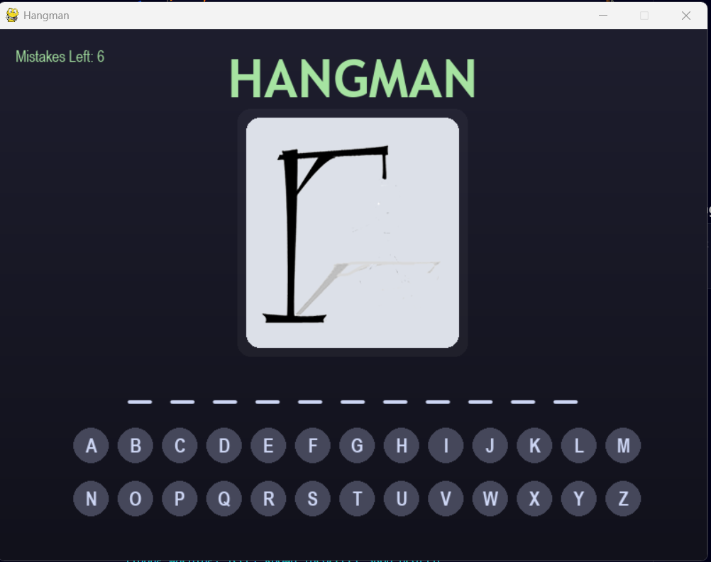
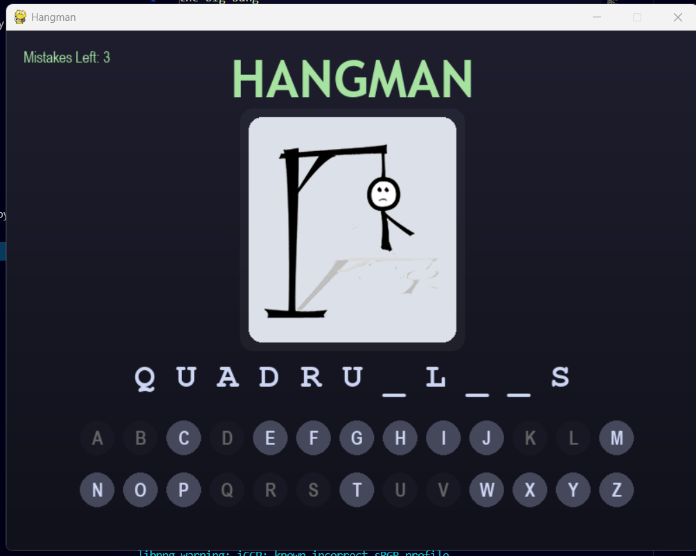
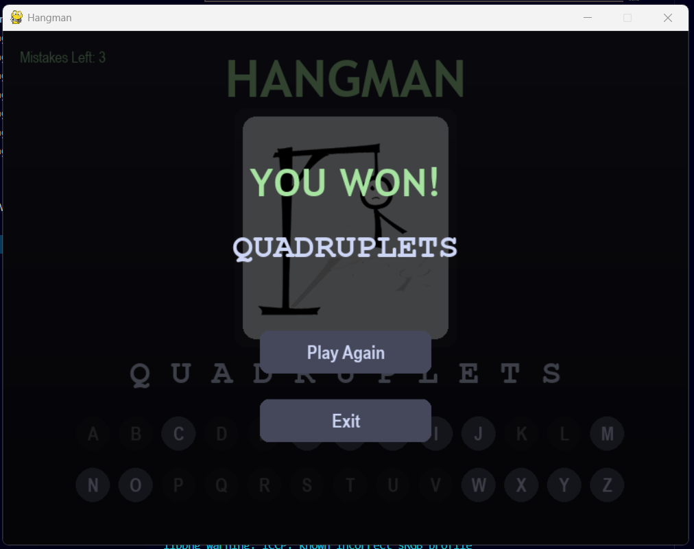
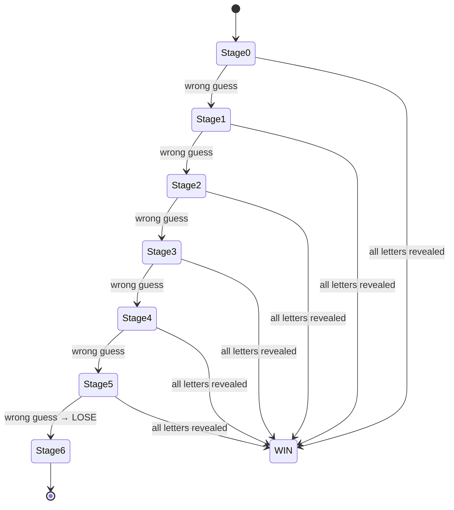
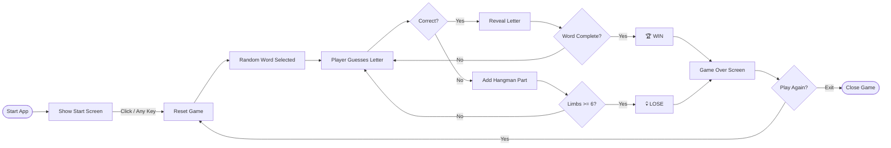
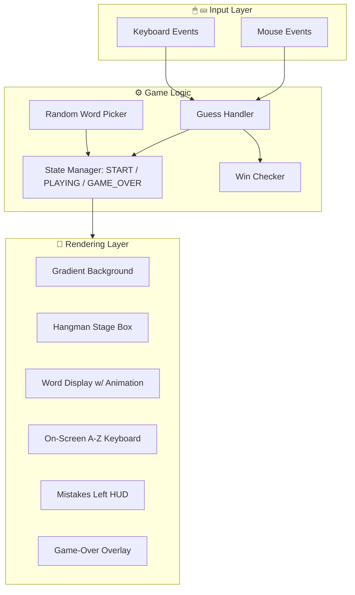
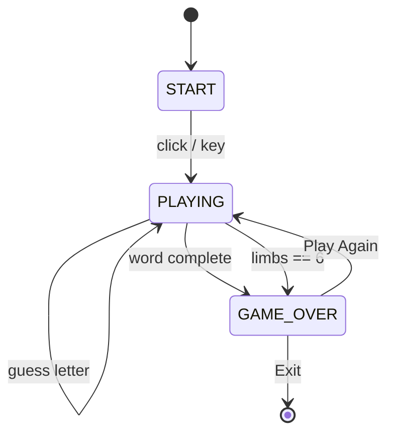

# 🎮 Hangman Game (PyGame)

<p align="center">
  
  
  
  
</p>

A modern and interactive **Hangman Game built with Python and PyGame**. Players guess a hidden word by selecting letters before the hangman is fully drawn.

This project focuses on **clean UI, keyboard interaction, sound feedback, and structured game architecture**, making it a polished mini-game built with Python.

---

## 🖼 Demo

<div align="center">

| Start Screen | Gameplay | Game Over |
|:---:|:---:|:---:|
|  |  |  |

</div>

---

## 🧠 Game Concept

Hangman is a classic word-guessing game:

- 🔤 A **hidden word** is selected randomly from `words.txt`
- 🎯 The player guesses letters from **A–Z** (mouse or keyboard)
- ❌ Each incorrect guess reveals a **new part of the hangman**
- 🏆 If the drawing completes before the word is guessed → **Game Over**
- ✨ If the player reveals the full word → **You Win**

---

## 🪜 Hangman Drawing Stages

```text
0 mistakes          1 mistake           2 mistakes          3 mistakes
┌──────────┐        ┌──────────┐        ┌──────────┐        ┌──────────┐
│          │        │    │     │        │    │     │        │    │     │
│          │        │    O     │        │    O     │        │    O     │
│          │        │          │        │    │     │        │   /│     │
│          │        │          │        │    │     │        │   / │     │
└──────────┘        └──────────┘        └──────────┘        └──────────┘

4 mistakes          5 mistakes          6 mistakes (LOSE)
┌──────────┐        ┌──────────┐        ┌──────────┐
│    │     │        │    │     │        │    │     │
│    O     │        │    O     │        │    O     │
│   /│\    │        │   /│\    │        │   /│\    │
│   / │    │        │   / │ \  │        │   / │ \  │
└──────────┘        └──────────┘        └──────────┘
```


```mermaid
stateDiagram-v2
    [*] --> Stage0
    Stage0 --> Stage1 : wrong guess
    Stage1 --> Stage2 : wrong guess
    Stage2 --> Stage3 : wrong guess
    Stage3 --> Stage4 : wrong guess
    Stage4 --> Stage5 : wrong guess
    Stage5 --> Stage6 : wrong guess → LOSE
    Stage6 --> [*]

    Stage0 --> WIN : all letters revealed
    Stage1 --> WIN : all letters revealed
    Stage2 --> WIN : all letters revealed
    Stage3 --> WIN : all letters revealed
    Stage4 --> WIN : all letters revealed
    Stage5 --> WIN : all letters revealed
```

---

## 🔄 User Flow


```mermaid
flowchart LR
    A([Start App]) --> B[Show Start Screen]
    B -- "Click / Any Key" --> C[Reset Game]
    C --> D[Random Word Selected]
    D --> E[Player Guesses Letter]

    E --> F{Correct?}

    F -- "Yes" --> G[Reveal Letter]
    G --> H{Word Complete?}
    H -- "Yes" --> I[🏆 WIN]
    H -- "No" --> E

    F -- "No" --> J[Add Hangman Part]
    J --> K{Limbs >= 6?}
    K -- "Yes" --> L[💀 LOSE]
    K -- "No" --> E

    I --> M[Game Over Screen]
    L --> M
    M --> N{Play Again?}
    N -- "Yes" --> C
    N -- "Exit" --> O([Close Game])
```

---

## 🚀 Features

- 🎮 Interactive **Hangman gameplay**
- ⌨ **Keyboard input** support (A–Z)
- 🖱 **Clickable alphabet buttons**
- 🖼 Progressive **hangman image rendering** (7 stages)
- 🔊 Sound effects:
  - ✅ Correct guess
  - ❌ Wrong guess
  - 🏆 Win
  - 💀 Lose
- 🎨 Modern **dark themed UI** (Catppuccin Mocha palette)
- 🔄 **Play Again** option
- ❌ **Exit button**
- 🧩 Clean and modular code structure
- ✨ Smooth sine-wave letter pop animation
- 🌌 Subtle vertical gradient background

---

## 🏗 Architecture Overview

The project is structured to separate **game logic, rendering, and assets**.


```mermaid
flowchart TB
    subgraph Input["🖱 ⌨ Input Layer"]
        Mouse[Mouse Events]
        Keys[Keyboard Events]
    end

    subgraph Logic["⚙️ Game Logic"]
        StateManager[State Manager: START / PLAYING / GAME_OVER]
        GuessHandler[Guess Handler]
        WinChecker[Win Checker]
        RandomWord[Random Word Picker]
    end

    subgraph Render["🎨 Rendering Layer"]
        BG[Gradient Background]
        HangmanBox[Hangman Stage Box]
        WordDisplay[Word Display w/ Animation]
        Keyboard[On-Screen A-Z Keyboard]
        HUD[Mistakes Left HUD]
        Overlay[Game-Over Overlay]
    end

    Mouse --> GuessHandler
    Keys --> GuessHandler
    GuessHandler --> StateManager
    GuessHandler --> WinChecker
    StateManager --> Render
    RandomWord --> StateManager
```

---

### 1️⃣ Game Logic
- Word selection from `words.txt`
- Guess validation against current word
- Win / Lose detection (limbs >= 6 OR word complete)

### 2️⃣ Rendering System
- Background gradient
- Hangman stage rendering (0 → 6)
- Word display with letter pop animation
- Alphabet buttons (rounded, hover-aware, disabled state)

### 3️⃣ Input Handling
- Mouse click on alphabet buttons
- Keyboard input (A–Z) via `pygame.K_a ... K_z`
- Mouse hover detection for button styling

### 4️⃣ Game State Management
- `STATE_START` → title screen with prompt
- `STATE_PLAYING` → main gameplay
- `STATE_GAME_OVER` → win/lose overlay with Play Again / Exit

---

## 🎨 Color Palette — Catppuccin Mocha

| Token | Hex | Usage |
|-------|-----|-------|
| 🟦 BG | `#1E1E2E` | Background |
| 🟪 Panel | `#313244` | HUD panels |
| 🟢 Highlight | `#A6E3A1` | Win / Correct |
| 🔴 Error | `#F38BA8` | Loss / Wrong |
| ⚪ Text | `#CDD6F4` | Primary text |
| 🩶 Button | `#45475A` | Button resting |
| ⬛ Disabled | `#181825` | Disabled button |

---

## 📂 Project Structure

```text
Hangman/
│
├── main.py              # 🎮 Main game logic and rendering
├── words.txt            # 📖 Word dataset for random selection
├── test_randomWord.py   # 🧪 Testing script for word picker
│
├── hangman0.png         # 🖼 Hangman stage 0 (no parts)
├── hangman1.png         # 🖼 Stage 1 — head
├── hangman2.png         # 🖼 Stage 2 — body
├── hangman3.png         # 🖼 Stage 3 — one arm
├── hangman4.png         # 🖼 Stage 4 — both arms
├── hangman5.png         # 🖼 Stage 5 — one leg
├── hangman6.png         # 🖼 Stage 6 — both legs (LOSE)
│
├── Correct.wav          # 🔊 Correct guess
├── Wrong.wav            # 🔊 Wrong guess
├── Win.wav              # 🔊 Win
├── Loose.wav            # 🔊 Lose
│
├── generate_sounds.py   # 🎵 Optional script for sound generation
│
├── Demo01.png           # 🖼 Start screen demo
├── Demo02.png           # 🖼 Gameplay demo
├── Demo03.png           # 🖼 Game result demo
│
└── README.md            # 📖 You are here
```

---

## ⚙ Requirements

- 🐍 **Python 3.8+**
- 🎮 **PyGame 2.x**

```bash
pip install pygame
```

---

## ▶ How to Run the Game

1️⃣ Clone the repository

```bash
git clone https://github.com/your-username/hangman-game.git
```

2️⃣ Navigate to the project folder

```bash
cd hangman-game
```

3️⃣ Install dependencies

```bash
pip install pygame
```

4️⃣ Run the game

```bash
python main.py
```

---

## 🎮 Controls

| Action | Input |
|--------|-------|
| 🅰 Select letter | 🖱 Mouse click on keyboard button |
| 🅰 Select letter | ⌨ Keyboard <kbd>A</kbd> – <kbd>Z</kbd> |
| 🔄 Restart game | 🖱 Click **Play Again** |
| ❌ Exit game | 🖱 Click **Exit** or press <kbd>Esc</kbd> |

---

## 📊 Game State Diagram


```mermaid
stateDiagram-v2
    [*] --> START
    START --> PLAYING : click / key
    PLAYING --> PLAYING : guess letter
    PLAYING --> GAME_OVER : word complete
    PLAYING --> GAME_OVER : limbs == 6
    GAME_OVER --> PLAYING : Play Again
    GAME_OVER --> [*] : Exit
```

---

## 💡 Future Improvements

- 🎚 Difficulty levels (Easy / Medium / Hard)
- 🏷 Word categories (Animals / Tech / Movies)
- ⏱ Timer mode
- 🏆 Persistent leaderboard
- ✨ Better animations (particle effects for win screen)
- 🌍 Multi-language word list

---

## 📜 License

This project is open-source and available under the **MIT License**.

---

## 👨‍💻 With Love

> Developed For You by **~Subh**

---

<p align="center">
  🎯 A timeless word game, beautifully reimagined.
</p>
