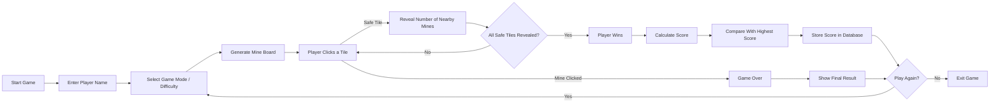

# 💣 MineSneeker - Python Minesweeper Game

A modern **Minesweeper-inspired game built using Python** with a clean UI and a database-backed **high score leaderboard**.

This project is part of my **Python Games Collection**, where I recreate classic games while exploring concepts like **game logic, UI interaction, and database integration**.

---

## 🎮 Game Overview

MineSneeker is a classic logic-based puzzle game where the player must uncover all safe cells without triggering hidden mines.

Each revealed tile shows the **number of mines in adjacent cells**, helping the player deduce where mines are located.

The game also includes a **score tracking system**, allowing players to compete for the **highest score across different difficulty modes**.

---

## ✨ Features

* 🎮 Classic Minesweeper gameplay
* 🧠 Logical puzzle mechanics
* 👤 Player name entry system
* 🏆 Database-based high score tracking
* ⚙️ Multiple game modes / difficulty levels
* 🎨 Clean UI built with Python
* 💾 Automatic score saving
* 🛡 Graceful fallback if database is unavailable

---

## 🧠 User Flow

## 🔄 User Flow



---

## 🧩 Game Logic

The game board is generated with randomly placed mines.

Each cell can be:

* **Mine**
* **Empty**
* **Numbered tile** indicating nearby mines

The player must use logic and deduction to safely uncover all non-mine cells.

---

## 🏗 Project Structure

```
MineSneeker
│
├── assets
│   └── images / game assets
│
├── db_manager.py
│   └── Handles database operations
│
├── main.py
│   └── Main game logic and UI
│
└── README.md
```

---

## 🗄 Database System

The game includes a **score management system** that:

* Stores player scores
* Tracks highest scores
* Compares player score with leaderboard
* Handles database connection safely

If the database fails to load, the game **continues without crashing**.

---

## 🛠 Tech Stack

* **Python 3**
* **Tkinter (UI Framework)**
* **SQLite (Database)**
* **Object-Oriented Programming**

---

## 🚀 Installation

### 1️⃣ Clone the Repository

```
git clone https://github.com/Subhadip-Paul2006/Games-Using-Python.git
```

### 2️⃣ Navigate to MineSneeker

```
cd Games-Using-Python/MineSneeker
```

### 3️⃣ Run the Game

```
python main.py
```

---

## 🎯 Future Improvements

Planned improvements for the game:

* 🔊 Sound effects
* 🎨 UI improvements
* ⏱ Timer based scoring system
* 🌐 Online leaderboard
* 📱 Mobile/Web version

---

## 📸 Preview

*(Add screenshots or GIF gameplay preview here)*

Example:

```
assets/gameplay_preview.png
```

---

## 📚 Learning Goals

This project helped me practice:

* Game logic design
* Python GUI development
* Database integration
* Project structuring
* Git & GitHub workflow

---

## 🤝 Contributing

Contributions are welcome!

If you'd like to improve the game:

1. Fork the repository
2. Create a new branch
3. Make your changes
4. Submit a Pull Request

---

## 📄 License

This project is open-source and available under the **MIT License**.

---

## 👨‍💻 Author

**Subhadip Paul**

B.Tech Computer Science Student
Exploring **Software Development, Game Development, and AI-powered systems**

GitHub:
https://github.com/Subhadip-Paul2006
