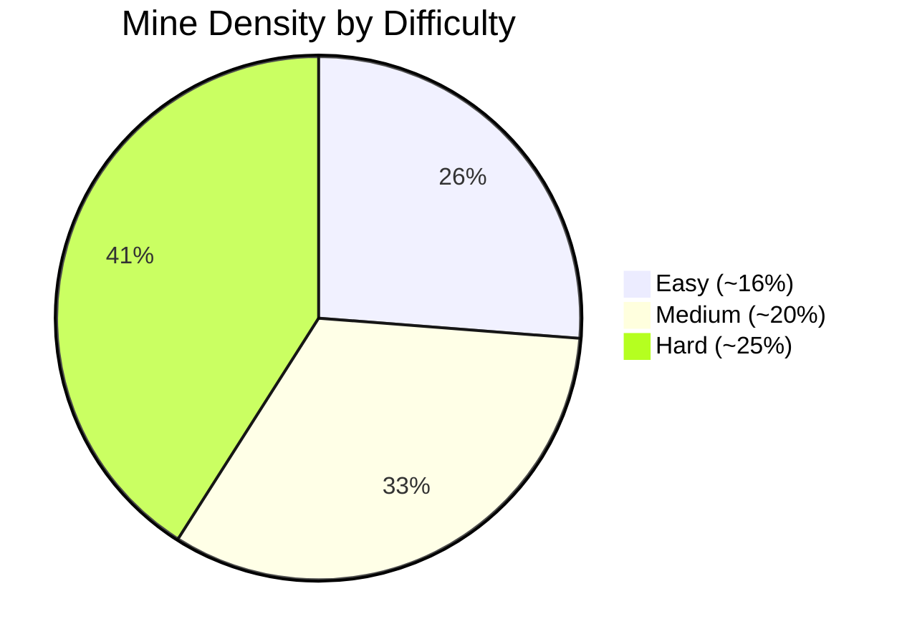
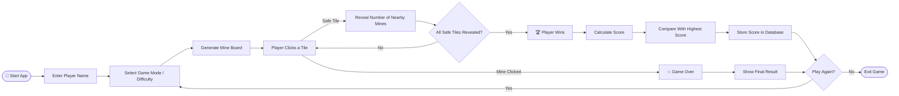
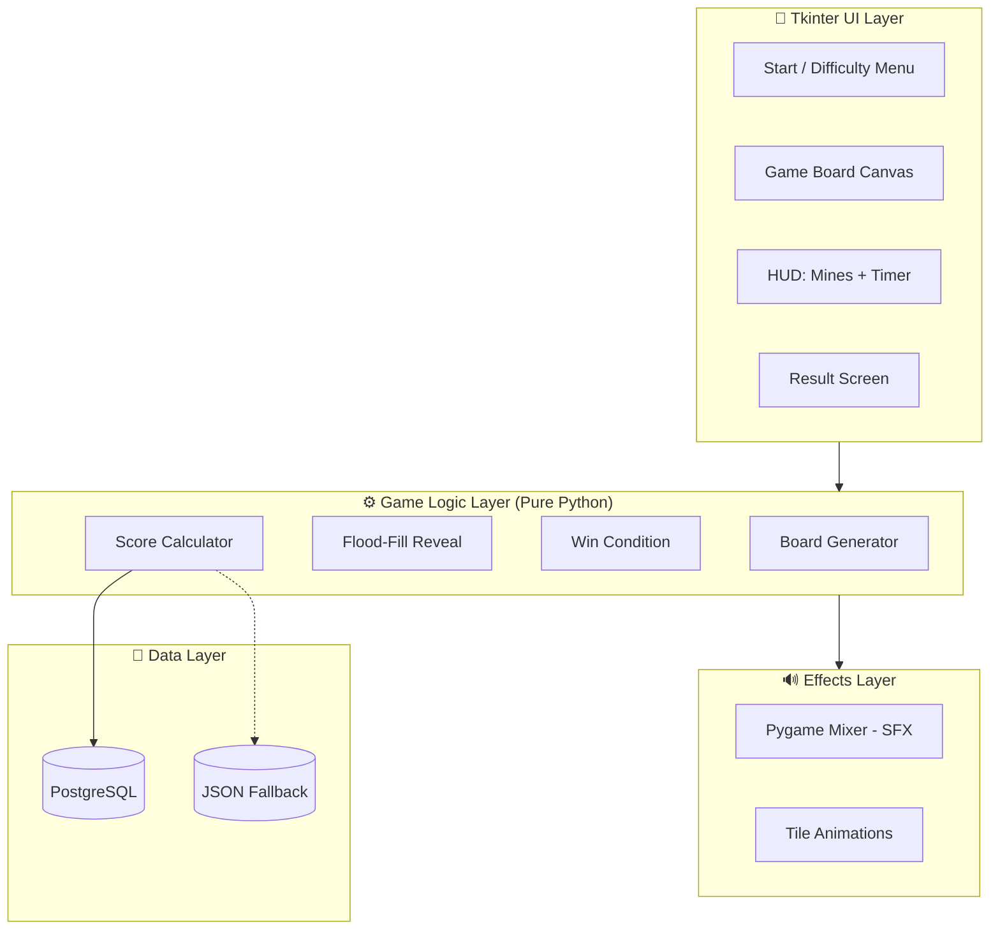
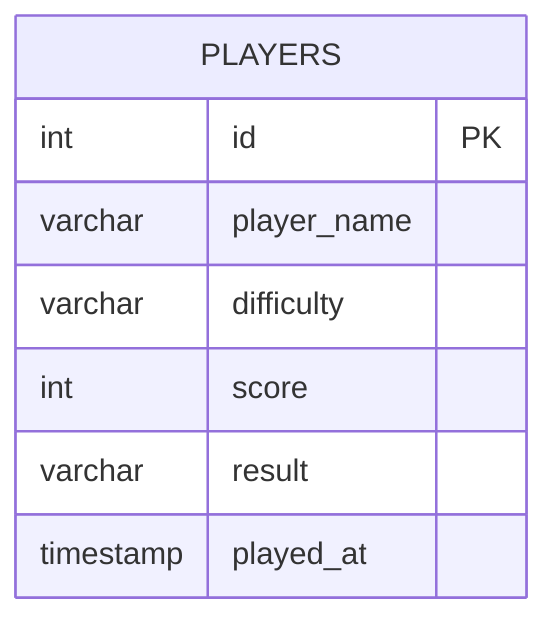
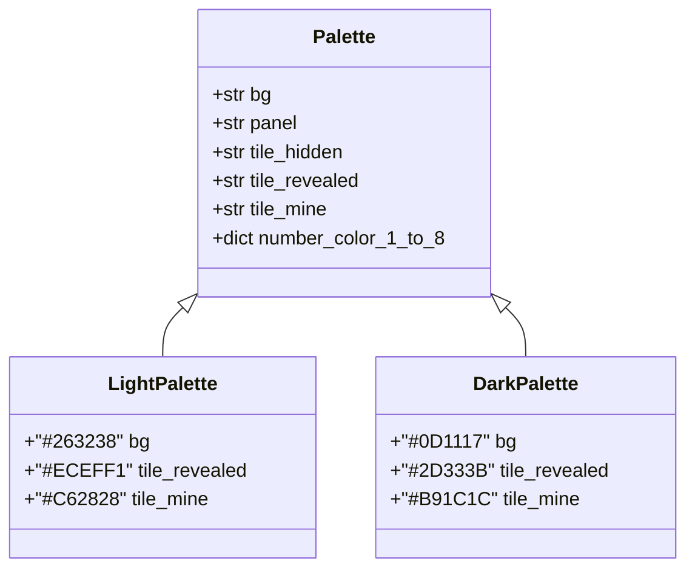

# 💣 MineSneeker — Python Minesweeper Game

<p align="center">
  
  
  
  
  
</p>

A modern **Minesweeper-inspired game built using Python** with a clean UI and a database-backed **high score leaderboard**.

This project is part of my **Python Games Collection**, where I recreate classic games while exploring concepts like **game logic, UI interaction, and database integration**.

---

## 🎮 Game Overview

MineSneeker is a classic logic-based puzzle game where the player must uncover all safe cells without triggering hidden mines.

Each revealed tile shows the **number of mines in adjacent cells**, helping the player deduce where mines are located.

The game also includes a **score tracking system**, allowing players to compete for the **highest score across different difficulty modes**.

---

## ✨ Features

- 🎮 Classic Minesweeper gameplay
- 🧠 Logical puzzle mechanics (numbered adjacency)
- 👤 Player name entry system
- 🏆 Database-based high-score tracking
- ⚙️ Multiple game modes / difficulty levels
- 🎨 Clean Tkinter UI with **light + dark mode**
- 💾 Automatic score saving
- 🛡 Graceful fallback to JSON if PostgreSQL is unavailable
- 🔊 Optional sound effects via PyGame
- 🎞 Animated tile reveals & explosion effects

---

## 🎯 Difficulty Levels

| Difficulty | Grid Size | Mine Probability | Difficulty |
|------------|:---------:|:----------------:|:----------:|
| 🟢 **Easy** | 8 × 16 | ~16% | ⭐ |
| 🟡 **Medium** | 12 × 24 | ~20% | ⭐⭐ |
| 🔴 **Hard** | 16 × 30 | ~25% | ⭐⭐⭐ |


```mermaid
pie title Mine Density by Difficulty
    "Easy (~16%)" : 16
    "Medium (~20%)" : 20
    "Hard (~25%)" : 25
```

---

## 🧩 Sample Board

```text
   1 2 3 4 5 6 7 8
  ┌────────────────┐
1 │ 1 1 0 0 0 0 0 0 │
2 │ 💣 1 0 0 0 0 0 0 │
3 │ 1 1 0 0 0 1 1 1 │
4 │ 0 0 0 0 0 1 💣 1 │
5 │ 0 1 1 1 0 1 1 1 │
6 │ 0 1 💣 1 0 0 0 0 │
7 │ 0 1 1 1 0 0 0 0 │
8 │ 0 0 0 0 0 0 0 0 │
  └────────────────┘
   🟦 hidden   ⬜ revealed (number)   💣 mine
```

---

## 🔄 User Flow


```mermaid
flowchart LR
    A([🚀 Start App]) --> B[Enter Player Name]
    B --> C[Select Game Mode / Difficulty]
    C --> D[Generate Mine Board]
    D --> E[Player Clicks a Tile]

    E -- "Safe Tile" --> F[Reveal Number of Nearby Mines]
    F --> G{All Safe Tiles Revealed?}
    G -- "No" --> E
    G -- "Yes" --> H[🏆 Player Wins]
    H --> I[Calculate Score]
    I --> J[Compare With Highest Score]
    J --> K[Store Score in Database]

    E -- "Mine Clicked" --> L[💥 Game Over]
    L --> M[Show Final Result]

    K --> N{Play Again?}
    M --> N
    N -- "Yes" --> C
    N -- "No" --> O([Exit Game])
```

---

## 🧠 Game Logic

The game board is generated with **randomly placed mines**. Each cell can be:

| Cell Type | Behavior |
|-----------|----------|
| 💣 **Mine** | Game ends immediately on reveal |
| ⬜ **Empty** | Auto-reveals adjacent empty cells (flood fill) |
| 🔢 **Numbered** | Shows count of adjacent mines (1–8) |
| 🚩 **Flagged** | Marked by player as suspected mine |

The player must use logic and deduction to safely uncover all non-mine cells.

---

## 🏗 Project Structure

```text
MineSneeker/
│
├── assets/                # 🖼 Game images / sprites
│
├── db_manager.py          # 💾 PostgreSQL high-score manager
│
├── main.py                # 🎮 Main game logic + Tkinter UI
│
└── README.md              # 📖 You are here
```

---

## 🧱 Layered Architecture


```mermaid
flowchart TB
    subgraph UI["🎨 Tkinter UI Layer"]
        Menu[Start / Difficulty Menu]
        Board[Game Board Canvas]
        HUD[HUD: Mines + Timer]
        Result[Result Screen]
    end

    subgraph Logic["⚙️ Game Logic Layer (Pure Python)"]
        BoardGen[Board Generator]
        FloodFill[Flood-Fill Reveal]
        WinCheck[Win Condition]
        ScoreCalc[Score Calculator]
    end

    subgraph IO["🔊 Effects Layer"]
        Sound[Pygame Mixer - SFX]
        Animation[Tile Animations]
    end

    subgraph Data["💾 Data Layer"]
        Postgres[(PostgreSQL)]
        JSON[(JSON Fallback)]
    end

    UI --> Logic
    Logic --> IO
    ScoreCalc --> Postgres
    ScoreCalc -.-> JSON
```

---

## 🗄 Database System

The game includes a **score management system** that:

- 💾 Stores player scores
- 📈 Tracks highest scores per difficulty
- 🆚 Compares player score with leaderboard
- 🛡 Handles database connection safely with JSON fallback

If the database fails to load, the game **continues without crashing**.

### ER Diagram


```mermaid
erDiagram
    PLAYERS {
        int      id PK
        varchar  player_name
        varchar  difficulty
        int      score
        varchar  result
        timestamp played_at
    }
```

### Required Table (auto-created)

```sql
CREATE TABLE minesweeper_scores (
    id           SERIAL PRIMARY KEY,
    player_name  VARCHAR(50) NOT NULL,
    difficulty   VARCHAR(10) NOT NULL,
    score        INT         NOT NULL,
    result       VARCHAR(10) NOT NULL,
    played_at    TIMESTAMP   DEFAULT NOW()
);
```

---

## 🎨 UI Themes


```mermaid
classDiagram
    class Palette {
        +str bg
        +str panel
        +str tile_hidden
        +str tile_revealed
        +str tile_mine
        +dict number_color_1_to_8
    }

    class LightPalette {
        +"#263238" bg
        +"#ECEFF1" tile_revealed
        +"#C62828" tile_mine
    }

    class DarkPalette {
        +"#0D1117" bg
        +"#2D333B" tile_revealed
        +"#B91C1C" tile_mine
    }

    Palette <|-- LightPalette
    Palette <|-- DarkPalette
```

---

## 🛠 Tech Stack

| Layer | Technology |
|-------|------------|
| 🐍 Language | Python 3 |
| 🎮 Engine (SFX) | PyGame (optional) |
| 🪟 UI Framework | Tkinter |
| 💾 Database | PostgreSQL (psycopg2) |
| 💽 Fallback | JSON file |

---

## 🚀 Installation

### 1️⃣ Clone the Repository

```bash
git clone https://github.com/Subhadip-Paul2006/Games-Using-Python.git
```

### 2️⃣ Navigate to MineSneeker

```bash
cd Games-Using-Python/MineSneeker
```

### 3️⃣ Install dependencies

```bash
pip install pygame
pip install psycopg2-binary
```

### 4️⃣ Configure database

Update `DB_CONFIG` in `db_manager.py` with your PostgreSQL credentials.

### 5️⃣ Run the Game

```bash
python main.py
```

---

## 🎯 Future Improvements

- 🎨 UI improvements (particle effects, smoother animations)
- ⏱ Timer-based scoring system
- 🌐 Online leaderboard
- 📱 Mobile / Web version
- 🧩 Custom board sizes
- 🏅 Achievement badges

---

## 📸 Preview

> *(Add screenshots or GIF gameplay preview here)*

```
assets/gameplay_preview.png
```

---

## 📚 Learning Goals

This project helped me practice:

- ⚙️ Game logic design
- 🪟 Python GUI development (Tkinter)
- 💾 Database integration (PostgreSQL)
- 📁 Project structuring
- 🔧 Git & GitHub workflow
- 🛡 Graceful degradation patterns

---

## 🤝 Contributing

Contributions are welcome! If you'd like to improve the game:

1. 🍴 Fork the repository
2. 🌿 Create a new branch
3. 💾 Make your changes
4. 🔁 Submit a Pull Request

---

## 📄 License

This project is open-source and available under the **MIT License**.

---

## 👨‍💻 Author

**Subh**

B.Tech Computer Science Student  
Exploring **Software Development, Game Development, and AI-powered systems**

GitHub: [https://github.com/Subhadip-Paul2006](https://github.com/Subhadip-Paul2006)

---

<p align="center">
  💣 Logic, luck, and a lot of careful clicking.
</p>
