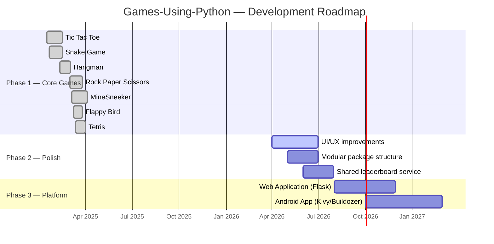
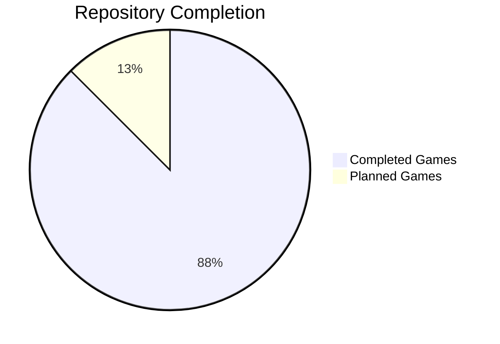
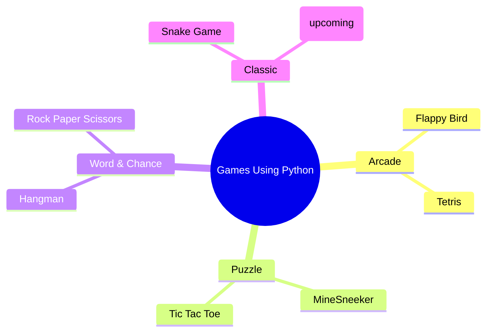
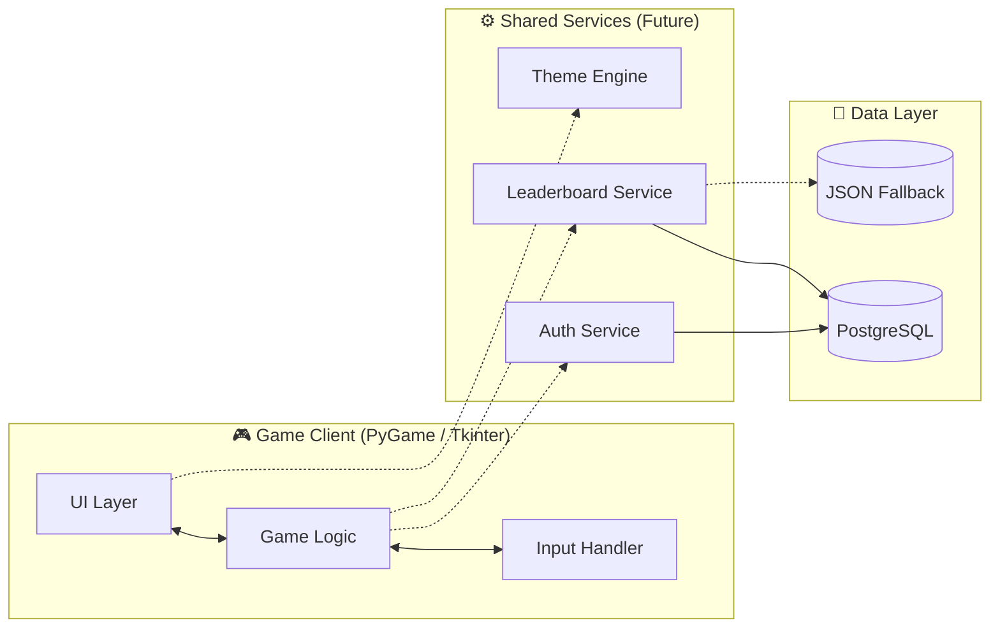
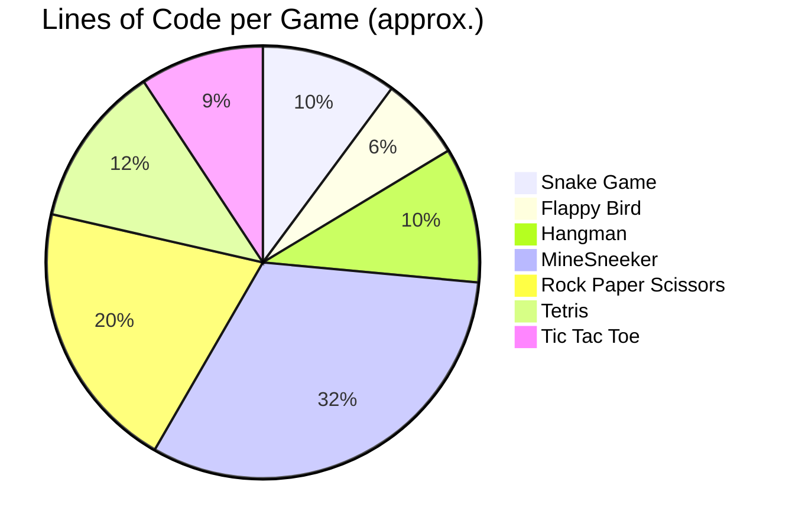
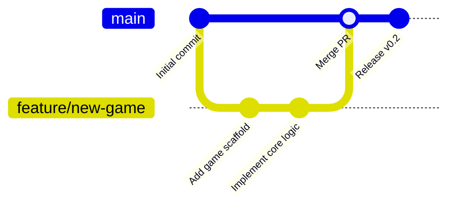

# 🎮 Games Using Python

<p align="center">
  
  
  
  
  
</p>

<p align="center">
  <strong>A collection of classic games built with Python — designed to grow into a unified Web &amp; Android gaming platform.</strong>
</p>

---

## 🌟 Project Vision at a Glance

```text
┌────────────────────────────────────────────────────────────────┐
│                                                                │
│   Individual Python Games  ──►  Modular Core  ──►  Platform    │
│   (Snake, Flappy, Tetris,       (shared UI,       (Web App +   │
│    RPS, Hangman, Mines,          leaderboard,     Android App) │
│    Tic-Tac-Toe, Pong)            login, theme)                 │
│                                                                │
└────────────────────────────────────────────────────────────────┘
```

The long-term goal of this repository is to build a **single platform (Web App / Android App)** that hosts multiple classic games developed using Python.

These games are currently being built and tested individually.  
In the future, they will be integrated into a **centralized gaming application** where users can:

- 🌐 Browse and play multiple classic games
- 🪟 Access games from a single interface
- 🎯 Experience smooth and interactive gameplay
- 💡 Enjoy a lightweight casual gaming platform

This repository serves as the **development and experimentation ground** for those games before they are integrated into the final application.

---

## 🗺️ Roadmap Timeline



### Roadmap Checklist

- ✅ Develop individual games using Python
- 🚧 Improve UI and gameplay experience
- 📦 Organize games into a modular structure
- 🌐 Build a **Web Application** to host all games
- 📱 Develop an **Android App** version of the platform

---

## 📊 Game Status Overview

> ⚠️ Please read the `README.md` inside each project folder before running the game.

| # | Game | Status | Developed By | Engine | Database |
|---|------|:------:|--------------|--------|:--------:|
| 1 | 🟦 Tic Tac Toe | ✅ Completed | Subh & Abhishek | PyGame | ✅ |
| 2 | 🐍 Snake Game | ✅ Completed | Subh & Abhishek | PyGame | ✅ |
| 3 | 🐦 Flappy Bird | ✅ Completed | Abhishek & Samhita | PyGame | ✅ |
| 4 | 🏓 Pong Game | 📌 Planned | Subh & Abhishek | PyGame | ❌ |
| 5 | 🔤 Hangman | ✅ Completed | Subh | PyGame | ❌ |
| 6 | 💣 MineSneeker | ✅ Completed | Subh | Tkinter | ✅ |
| 7 | ✊ Rock Paper Scissors | ✅ Completed | Subh | Tkinter | ✅ |
| 8 | 🧱 Tetris | ✅ Completed | Subh | PyGame | ❌ |

### Completion Donut



---

## 🎮 Games Included



### 🐍 Snake Game
Move the snake & beat the highest score. Bonus food appears randomly with a pulsing gold glow.

### 🐦 Flappy Bird
Navigate the bird through pipes without crashing. Coins drop between pipes for extra points.

### 🔤 Hangman
Guess the hidden word before the hangman drawing completes. Modern dark-themed UI with on-screen keyboard.

### ❌ Tic Tac Toe
Just play it with your partner, friend, parents and enjoy... Single-player PyGame version with database.

### 💣 MineSneeker
Guess the mine, and your game is over. Multiple difficulty modes and persistent leaderboard.

### ✊ Rock Paper Scissors
Experience playing rock paper scissors virtually on PC. Includes login, series gameplay and global leaderboard.

### 🧱 Tetris
A polished PyGame Tetris with procedural sound, neon palettes and 3D beveled block rendering.

### 🏓 Pong (Upcoming)
Two-player paddle game inspired by the classic arcade.

---

## 🧱 Repository Architecture

```text
Games-Using-Python/
│
├── 📁 Flappy Bird/            # 🐦 Pure PyGame arcade with coin pickups
│   ├── Flappy_Bird.py
│   ├── assests/
│   │   ├── images/            # Bird and coin sprites
│   │   └── sounds/            # Flap, point, hit, die, swoosh SFX
│   ├── .env
│   ├── requirements.txt
│   └── README.md
│
├── 📁 Hangman/                # 🔤 Modern dark-themed PyGame hangman
│   ├── main.py
│   ├── words.txt
│   ├── generate_sounds.py
│   ├── hangman0..6.png
│   ├── *.wav
│   └── README.md
│
├── 📁 MineSneeker/            # 💣 Tkinter minesweeper + Postgres
│   ├── main.py
│   ├── db_manager.py
│   ├── assets/
│   │   └── sounds/            # Game audio effects
│   └── README.md
│
├── 📁 Rock Paper Scissors/    # ✊ Tkinter RPS w/ login + leaderboard
│   ├── main.py
│   ├── loginGame.py
│   ├── db_manager.py
│   ├── setup_db.py
│   ├── Images/                # Sprites and screenshots
│   └── README.md
│
├── 📁 Snake Game/             # 🐍 PyGame snake with PostgreSQL leaderboard
│   ├── snake_game.py
│   ├── requirements.txt
│   └── README.md
│
├── 📁 Tetris Game/            # 🧱 PyGame Tetris w/ procedural audio
│   ├── tetris.py
│   ├── block.py
│   ├── constants.py
│   ├── generate_sounds.py
│   ├── *.wav                  # Procedural 8-bit audio
│   └── README.md
│
├── 📁 Tic Tac Toe/            # ❌ PyGame tic-tac-toe w/ Postgres
│   ├── main.py
│   ├── db_manager.py
│   ├── db_utils.py
│   ├── requirements.txt
│   └── README.md
│
├── 📄 APP_DEVELOPMENT.md      # 📱 Flutter & Firebase App Roadmap
├── 📄 DESIGN.md               # 🎨 Design System & UI Specs
├── 📄 PRD.md                  # 📋 Product Requirements Document
├── 📄 TRD.md                  # 🛠 Technical Requirements Document
├── 📄 README.md               # ⬅️ Root documentation
└── 📄 .gitignore
```

---

## 🧠 Shared Architecture Across Games



---

## 🛠️ Tech Stack Distribution



| Layer | Technology |
|-------|------------|
| **Language** | Python 3.x |
| **Game Engine** | PyGame 2.x |
| **GUI Toolkit** | Tkinter (RPS, MineSneeker) |
| **Database** | PostgreSQL (psycopg2) |
| **Image Rendering** | Pillow (PIL) |
| **Audio** | PyGame Mixer / Wave (procedural) |

---

## 🚀 Goal of This Repository

This repository is a personal project to explore **game development using Python** by recreating classic games. Each game demonstrates different concepts of programming, UI rendering, and interactive gameplay. More games will continue to be added as the project grows.

> Ultimately, the aim is to build a **complete multi-game platform** where users can enjoy several classic games from a single **Web or Android application**.

---

## 🤝 Contributing



1. 🍴 Fork the repo
2. 🌿 Create a feature branch (`git checkout -b feature/AmazingGame`)
3. 💾 Commit your changes (`git commit -m 'feat: add my new game'`)
4. 📤 Push to the branch (`git push origin feature/AmazingGame`)
5. 🔁 Open a Pull Request

---

## 📜 License

Distributed under the **MIT License**. See `LICENSE` for more information.

---

## 👥 Contributors

> 💡 The full task breakdown for the upcoming **Flutter + Firebase application** lives in [`APP_DEVELOPMENT.md`](./APP_DEVELOPMENT.md).

<table align="center">
  <tr>
    <td align="center" width="33%">
      <a href="https://github.com/Subhadip-Paul2006">
        <br/>
        <sub><b>Subhadip Paul</b></sub>
      </a><br/>
      🧑‍✈️ <em>Lead Developer</em><br/>
      Architecture · Firebase · DevOps
    </td>
    <td align="center" width="33%">
      <br/>
      <sub><b>Abhishek</b></sub><br/>
      🎨 <em>Frontend Engineer</em><br/>
      Flutter UI · Animations · Game Shells
    </td>
    <td align="center" width="33%">
      <br/>
      <sub><b>Samhita</b></sub><br/>
      🧪 <em>UI/UX & QA Lead</em><br/>
      Design · Logic Port · Testing
    </td>
  </tr>
</table>

### Contribution Breakdown

| Contributor | Role | Primary Focus | Games Worked On |
|------------|------|---------------|-----------------|
| 🧑‍✈️ **Subhadip Paul** | Lead Developer | Architecture, Firebase backend, DevOps, code review | Tic Tac Toe · Snake · Hangman · MineSneeker · Rock Paper Scissors · Tetris |
| 🎨 **Abhishek** | Frontend Engineer | Flutter UI, animations, game UI shells, navigation | Tic Tac Toe · Snake · Flappy Bird · Pong |
| 🧪 **Samhita** | UI/UX & QA Lead | Design system, game logic ports, QA, localization | Flappy Bird |

---

<p align="center">
  Built with ❤️ by <a href="https://github.com/Subhadip-Paul2006">Subhadip Paul</a>, Abhishek &amp; Samhita.
</p>
