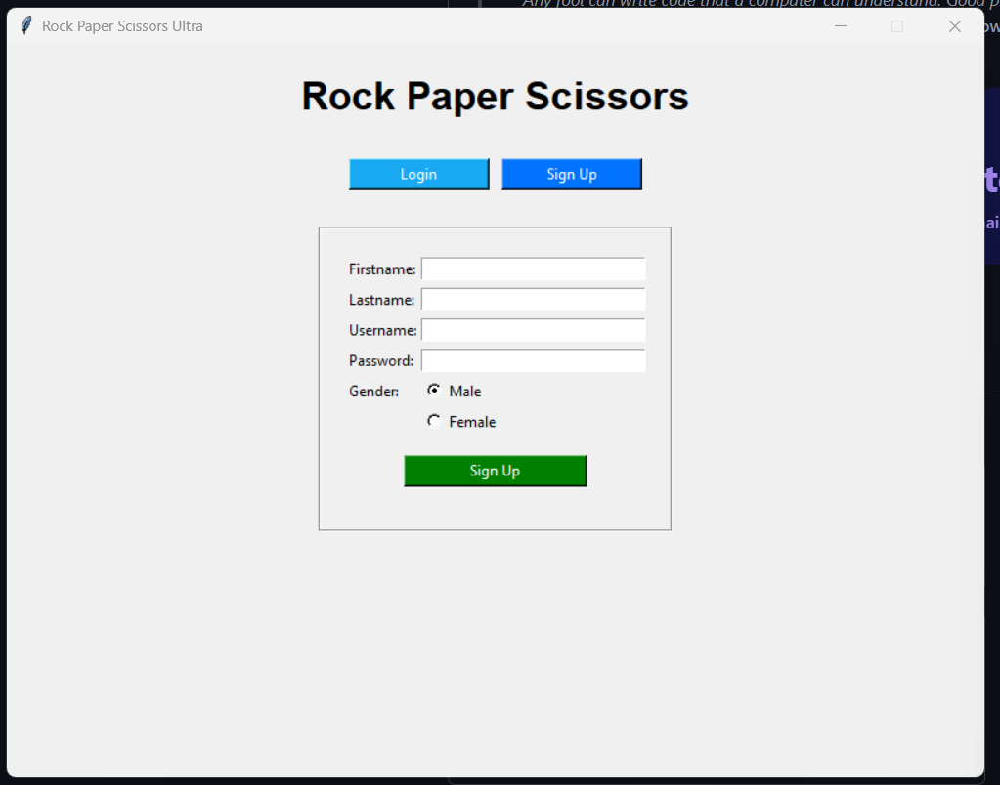
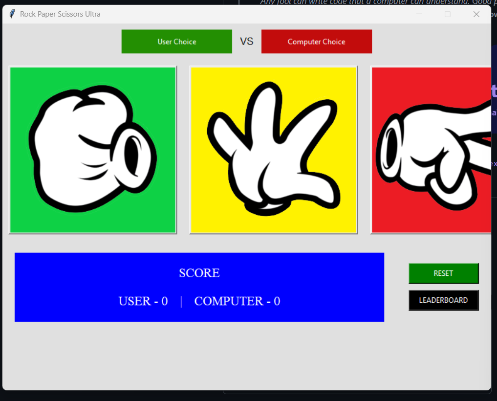
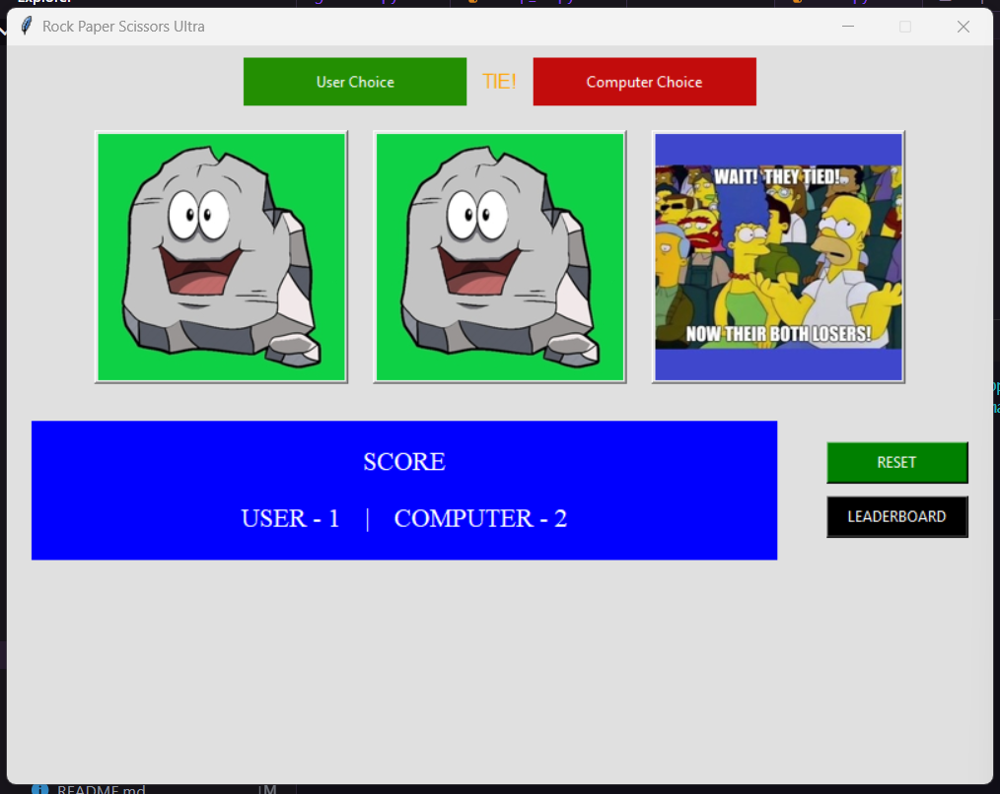
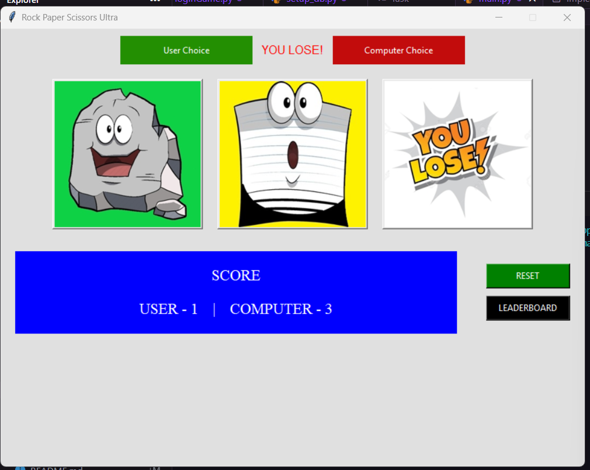
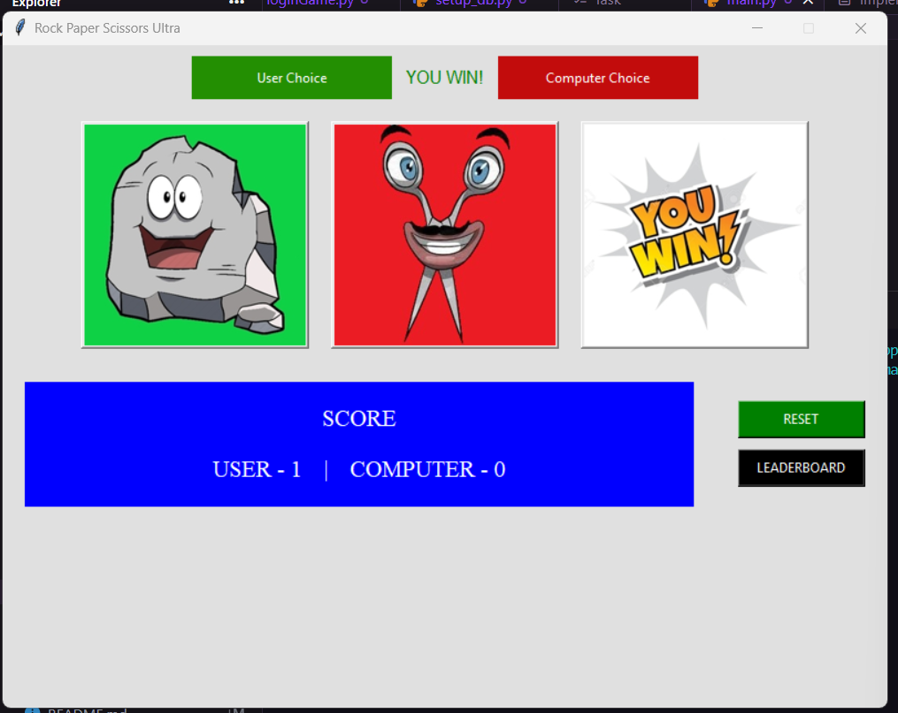
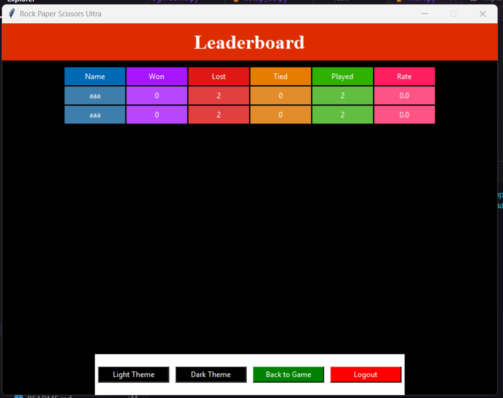

<h1 align="center">
  🎮 Rock Paper Scissors Ultra 🚀
</h1>

<p align="center">
  <strong>A modern, interactive, and database-driven Rock Paper Scissors game built with Python and Tkinter!</strong>
</p>

<p align="center">
  
  
  
</p>

---

## 📖 Introduction

**Rock Paper Scissors Ultra** is a full-fledged desktop application that brings the classic hand game to life with a comprehensive graphical user interface (GUI). Beyond just the simple mechanics, this project features an entire ecosystem including user authentication, real-time score tracking, series matches against a computer opponent, and a persistent global leaderboard driven by a PostgreSQL database backend. 

Whether you're battling for the highest win rate or just casually playing, this project demonstrates a robust implementation of GUI design and database management in Python.

---

## ✨ Key Features

- **🔐 User Authentication System:** Secure Sign Up and Log In functionality for individual players.
- **🙋 User Personalization:** Dynamic avatars representing the user based on gender selection during sign-up.
- **🕹️ Series Gameplay:** Play a defined set of rounds (e.g., Best of 5) against a randomized computer AI.
- **🏆 Persistent Leaderboard:** Real-time tracking of Games Won, Lost, Tied, Played, and absolute Win Rate. Top players are dynamically displayed.
- **🎨 Interactive UI:** Clean interface with visual feedback, customized "hands" images, and post-game result popups with confetti animations.
- **🌓 Adaptive Themes:** Built-in Light and Dark theme toggles straight from the Leaderboard.
- **💾 Database Driven:** Reliable data persistence utilizing PostgreSQL to safely store user credentials and game statistics over time.

---

## 🛠️ Tech Stack & Technologies

This project uses the following technologies to function seamlessly:

| Technology | Purpose |
|------------|---------|
| **Python 3.x** | Core Programming Language for logic and mechanics. |
| **Tkinter** | Standard GUI library in Python used for building screens and elements. |
| **PostgreSQL** | Relational database to persist users and leaderboard statistics. |
| **psycopg2** | PostgreSQL database adapter for Python to run queries. |
| **Pillow (PIL)** | Python Imaging Library utilized for rendering, resizing, and displaying images within Tkinter. |

---

## 📂 Project Structure

Here is a look at how the project files are organized:

```text
📦 Rock Paper Scissors
 ┣ 📂 Images                   # Contains all game assets, icons, and avatars
 ┃ ┣ 📜 Rockimg.jpg
 ┃ ┣ 📜 Paperimg.jpg
 ┃ ┣ 📜 Scissorsimg.jpg
 ┃ ┣ 📜 Screen01.png           ...and other GUI screenshots
 ┃ ┗ 📜 confeti.gif            ...etc.
 ┣ 📜 db_manager.py            # Centralized database connection and queries handler
 ┣ 📜 loginGame.py             # Alternative integrated auth & game logic implementation
 ┣ 📜 main.py                  # Primary entry point combining GUI screens and game flow
 ┗ 📜 setup_db.py              # Script to initialize the PostgreSQL tables
```

---

## 🧠 Game Logic Explained

The game logic is built around standard Rock-Paper-Scissors rules mixed with session state management:

1. **Authentication:** 
   - A new user registers, creating an entry in both the `USERS` and `LEADERBOARD` tables in PostgreSQL.
   - Returning users authenticate to fetch their current profile.
2. **The Match:**
   - The user selects Rock, Paper, or Scissors via image buttons.
   - The computer randomly selects its hand using Python's `random.choice`.
   - **Rules:** `Rock beats Scissors` > `Scissors beats Paper` > `Paper beats Rock`.
3. **Series Calculation:**
   - Instead of a single round, the game is configured to run for a maximum number of turns (default is 5).
   - Wins, losses, and ties for rounds are tracked via variables in `GameScreen`.
4. **Conclusion & DB Update:**
   - After the final turn, the overall series result is evaluated and declared (Win/Lose/Tie).
   - `db_manager.py` executes an `UPDATE` query to modify the player's total stats (GamesPlayed, GamesWon, etc.) and recalculates their `WiningRate`.

---

## 🔄 User Flow

```text
[Start Application]
       ↓
[Login / Sign Up Page] ──(New User)──> [Register Account & Initialize DB Stats]
       ↓
[Welcome Screen] (Displays User Avatar vs Computer)
       ↓
[Game Screen] (Play Rounds / Best of 'x')
       ↓
[Result Popup] ──> Calculates Series ──> Updates PostgreSQL Database
(Win/Lose/Tie)
       ↓
    [Options] ──────────────┐
       │                    │
       ├─> [Play Again] ────┘ (Loops back to Game Screen)
       │
       ├─> [Leaderboard Screen] (View Top Placements & Switch Themes)
       │
       └─> [Logout / Exit]
```

---

## 📸 Screenshots

Here is a visual walkthrough of the application:

### 1. Login Page
<p align="center">
  
</p>

### 2. Game Page
<p align="center">
  
</p>

### 3. Winner Output
<p align="center">
  
</p>

### 4. Lose Output
<p align="center">
  
</p>

### 5. Tied Output
<p align="center">
  
</p>

### 6. Leaderboards
<p align="center">
  
</p>

---

## ⚙️ Installation & Setup

Want to run this project locally? Follow these steps:

### Prerequisites
1. **Python 3.x** installed.
2. **PostgreSQL** installed and running on your system.

### Steps

1. **Clone the repository:**
   ```bash
   git clone https://github.com/your-username/Rock-Paper-Scissors-Ultra.git
   cd "Rock Paper Scissors"
   ```

2. **Install required dependencies:**
   Make sure to install Pillow and psycopg2.
   ```bash
   pip install pillow psycopg2
   ```

3. **Database Configuration:**
   - Open pgAdmin or PSQL console and ensure you have a database cluster ready.
   - Look into `db_manager.py` and `setup_db.py` to ensure the `DB_CONFIG` matches your local Postgres credentials (default expects password: `subh06`, user: `postgres`).

4. **Initialize the Database:**
   Run the initialization script to create the required tables (`USERS` and `LEADERBOARD`).
   ```bash
   python setup_db.py
   ```

5. **Start the Game:**
   Run the main application script!
   ```bash
   python main.py
   ```

---

## 🚀 Future Improvements

While the application is fully functional, here are some scalable enhancements for future releases:

1. **Password Hashing:** Implement `bcrypt` to hash passwords before storing them in the database for better security compliance.
2. **Environment Variables:** Migrate hardcoded database credentials out of `db_manager.py` into a `.env` file for safer codebase sharing.
3. **Multiplayer Capabilities:** Add socket programming (`socketio`) or a REST API backend to allow two real users to play against each other over a network.
4. **Enhanced Animations:** Move from static images to smooth transition animations using standard GUI animation loops or advanced libraries.
5. **Modernized UI Framework:** Upgrade from standard Tkinter to `CustomTkinter` or `PyQt` for an out-of-the-box modern, rounded aesthetic.

---

## 🤝 Contribution

Contributions, issues, and feature requests are always welcome! 

1. Fork the Project
2. Create your Feature Branch (`git checkout -b feature/AmazingFeature`)
3. Commit your Changes (`git commit -m 'Add some AmazingFeature'`)
4. Push to the Branch (`git push origin feature/AmazingFeature`)
5. Open a Pull Request

---

## 📜 License

Distributed under the MIT License. See `LICENSE` for more information.

---

## 👨‍💻 Author

**Rock Paper Scissors Ultra Project**

Designed and Developed by **[@Subhadip-Paul2006]**

Feel free to reach out with improvements, feedback, or collaborations!
