<h1 align="center">🎮 Rock Paper Scissors Ultra 🚀</h1>

<p align="center">
  <strong>A modern, interactive, and database-driven Rock Paper Scissors game built with Python and Tkinter!</strong>
</p>

<p align="center">
  
  
  
  
  
</p>

---

## 📖 Introduction

**Rock Paper Scissors Ultra** is a full-fledged desktop application that brings the classic hand game to life with a comprehensive graphical user interface (GUI). Beyond just the simple mechanics, this project features an entire ecosystem including **user authentication**, real-time score tracking, **series matches** against a computer opponent, and a **persistent global leaderboard** driven by a PostgreSQL database backend.

Whether you're battling for the highest win rate or just casually playing, this project demonstrates a robust implementation of GUI design and database management in Python.

---

## 🎯 Game Rules — The Triangle of Power

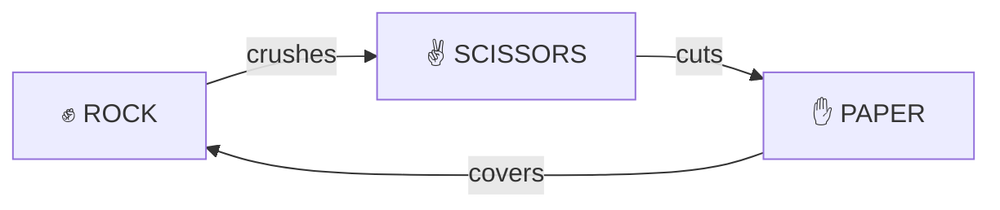
```mermaid
flowchart LR
    R[✊ ROCK] -- "crushes" --> S[✌ SCISSORS]
    S -- "cuts" --> P[✋ PAPER]
    P -- "covers" --> R
```

```text
        ✊ ROCK
       ╱       ╲
  covers ✋    crushes
  PAPER  ╲    ╱ SCISSORS
         ✌
         cuts
```

> **Rock** beats **Scissors** · **Scissors** beats **Paper** · **Paper** beats **Rock**

---

## ✨ Key Features

- 🔐 **User Authentication System:** Secure Sign Up and Log In for individual players
- 🙋 **User Personalization:** Dynamic avatars representing the user based on gender selection during sign-up
- 🕹️ **Series Gameplay:** Play a defined set of rounds (e.g., Best of 5) against a randomized computer AI
- 🏆 **Persistent Leaderboard:** Real-time tracking of Games Won, Lost, Tied, Played, and **Win Rate**
- 🎨 **Interactive UI:** Clean interface with visual feedback, customized hand images, and post-game popups with confetti animations
- 🌓 **Adaptive Themes:** Built-in **Light and Dark** theme toggles straight from the Leaderboard
- 💾 **Database Driven:** Reliable data persistence using PostgreSQL to safely store credentials and statistics

---

## 🛠️ Tech Stack & Technologies

| Technology | Purpose |
|------------|---------|
| 🐍 **Python 3.x** | Core programming language for logic and mechanics |
| 🪟 **Tkinter** | Standard GUI library for building screens and elements |
| 🐘 **PostgreSQL** | Relational database to persist users and leaderboard stats |
| 🔌 **psycopg2** | PostgreSQL database adapter for Python to run queries |
| 🖼 **Pillow (PIL)** | Image rendering, resizing, and displaying inside Tkinter |

---

## 🔄 User Flow

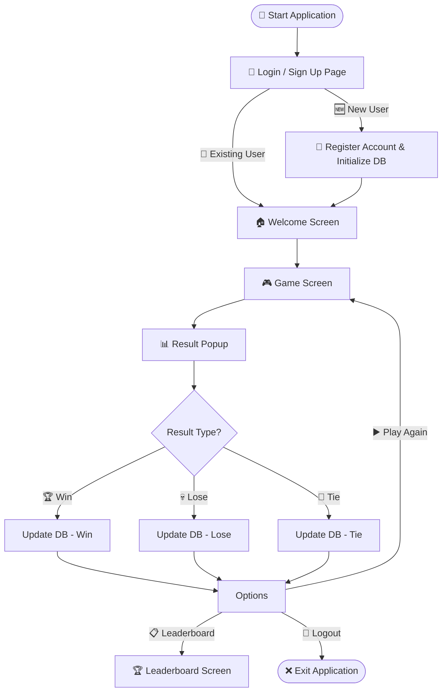
```mermaid
flowchart TD
    A([🚀 Start Application]) --> B[🔐 Login / Sign Up Page]

    B -- "🆕 New User" --> C[📝 Register Account & Initialize DB]
    B -- "👤 Existing User" --> D[🏠 Welcome Screen]

    C --> D

    D --> E[🎮 Game Screen]

    E --> F[📊 Result Popup]

    F --> G{Result Type?}

    G -- "🏆 Win"  --> H[Update DB - Win]
    G -- "💀 Lose" --> I[Update DB - Lose]
    G -- "🤝 Tie"  --> J[Update DB - Tie]

    H --> K[Options]
    I --> K
    J --> K

    K -- "▶️ Play Again"    --> E
    K -- "📋 Leaderboard"  --> L[🏆 Leaderboard Screen]
    K -- "🚪 Logout"       --> M([❌ Exit Application])
```

---

## 🔐 Authentication Sequence

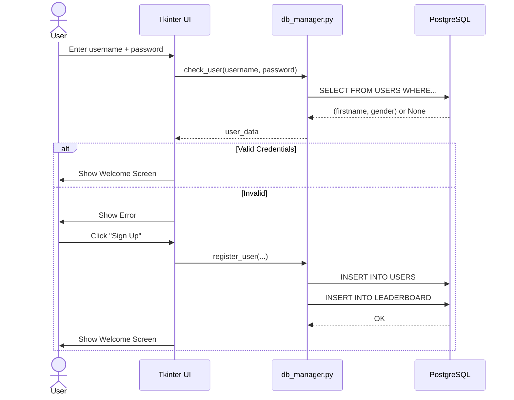
```mermaid
sequenceDiagram
    actor User
    participant UI as Tkinter UI
    participant DB as db_manager.py
    participant PG as PostgreSQL

    User->>UI: Enter username + password
    UI->>DB: check_user(username, password)
    DB->>PG: SELECT FROM USERS WHERE...
    PG-->>DB: (firstname, gender) or None
    DB-->>UI: user_data

    alt Valid Credentials
        UI->>User: Show Welcome Screen
    else Invalid
        UI->>User: Show Error
        User->>UI: Click "Sign Up"
        UI->>DB: register_user(...)
        DB->>PG: INSERT INTO USERS
        DB->>PG: INSERT INTO LEADERBOARD
        PG-->>DB: OK
        UI->>User: Show Welcome Screen
    end
```

---

## 🗄️ Database Schema

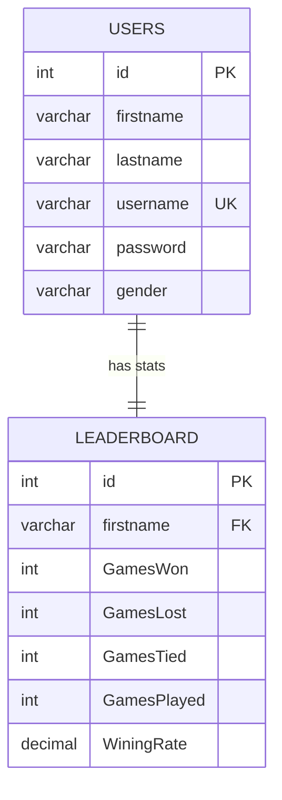
```mermaid
erDiagram
    USERS ||--|| LEADERBOARD : "has stats"
    USERS {
        int      id PK
        varchar  firstname
        varchar  lastname
        varchar  username UK
        varchar  password
        varchar  gender
    }
    LEADERBOARD {
        int      id PK
        varchar  firstname FK
        int      GamesWon
        int      GamesLost
        int      GamesTied
        int      GamesPlayed
        decimal  WiningRate
    }
```

### Schema Initialization

```sql
CREATE TABLE USERS (
    id        SERIAL PRIMARY KEY,
    firstname VARCHAR(50),
    lastname  VARCHAR(50),
    username  VARCHAR(50) UNIQUE,
    password  VARCHAR(100),
    gender    VARCHAR(10)
);

CREATE TABLE LEADERBOARD (
    id           SERIAL PRIMARY KEY,
    firstname    VARCHAR(50) UNIQUE,
    GamesWon     INT DEFAULT 0,
    GamesLost    INT DEFAULT 0,
    GamesTied    INT DEFAULT 0,
    GamesPlayed  INT DEFAULT 0,
    WiningRate   DECIMAL(5,2) DEFAULT 0
);
```

---

## 🏗️ Application Architecture

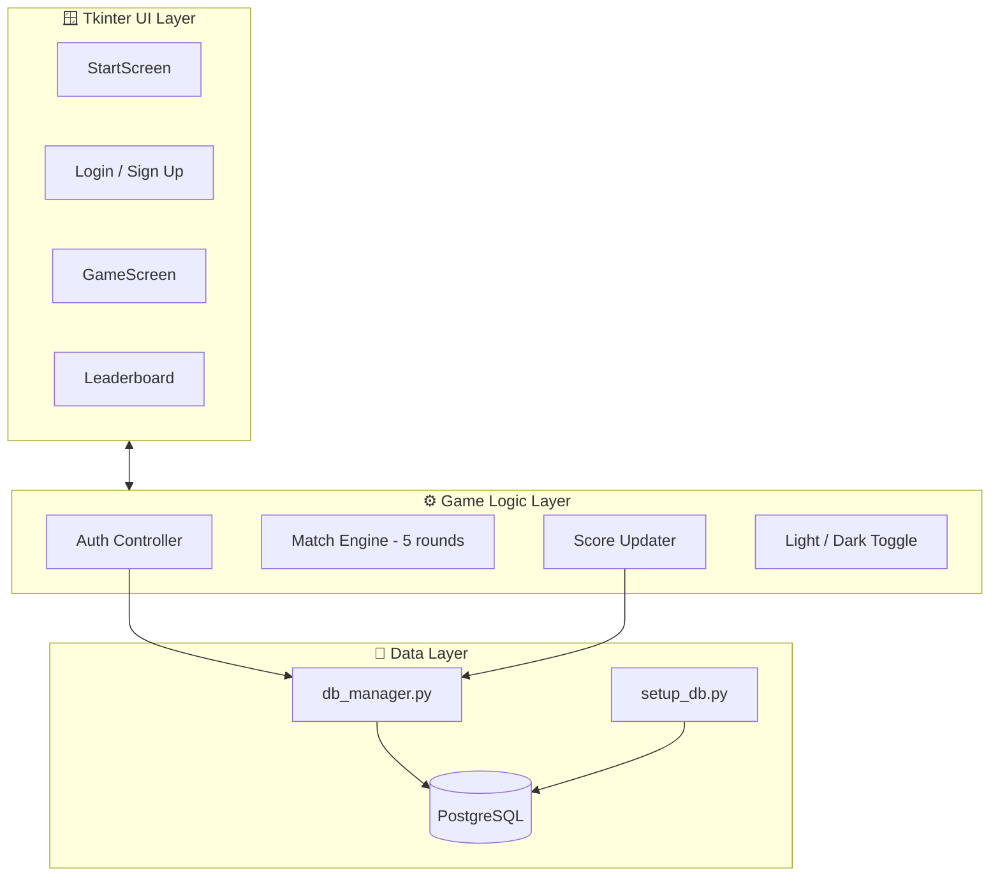
```mermaid
flowchart TB
    subgraph UI["🪟 Tkinter UI Layer"]
        StartScreen[StartScreen]
        Login[Login / Sign Up]
        GameScreen[GameScreen]
        Leaderboard[Leaderboard]
    end

    subgraph Logic["⚙️ Game Logic Layer"]
        Auth[Auth Controller]
        MatchEngine[Match Engine - 5 rounds]
        ScoreUpdater[Score Updater]
        ThemeToggle[Light / Dark Toggle]
    end

    subgraph Data["💾 Data Layer"]
        DBMgr[db_manager.py]
        Setup[setup_db.py]
        PG[(PostgreSQL)]
    end

    UI <--> Logic
    Auth --> DBMgr
    ScoreUpdater --> DBMgr
    DBMgr --> PG
    Setup --> PG
```

---

## 📂 Project Structure

```text
Rock Paper Scissors/
│
├── Images/                  # 🖼 All game assets & icons (sprites, UI elements, screenshots)
├── db_manager.py            # 🔌 Centralized DB connection + queries
├── setup_db.py              # 🛠 DB schema initialization
├── main.py                  # 🚪 Primary entry point combining GUI + flow
├── loginGame.py             # 🔐 Alternative integrated auth & game logic
├── .gitignore               # 🙈 Git ignore configuration
└── README.md                # 📖 You are here
```

---

## 🧠 Game Logic Explained

The game logic is built around standard **Rock-Paper-Scissors rules** mixed with session state management:

1. **Authentication:** A new user registers, creating entries in both `USERS` and `LEADERBOARD` tables. Returning users authenticate to fetch their profile.

2. **The Match:** The user selects Rock, Paper, or Scissors via image buttons. The computer randomly selects using Python's `random.choice`.

3. **Series Calculation:** The game is configured to run for a maximum of 5 turns. Wins, losses, and ties are tracked via variables in `GameScreen`.

4. **Conclusion & DB Update:** After the final turn, the overall series result is evaluated. `db_manager.py` executes an `UPDATE` query to modify stats and recalculate `WiningRate`.

---

## 📸 Screenshots

| 1. Login Page | 2. Game Page | 3. Winner Output |
|:---:|:---:|:---:|
| 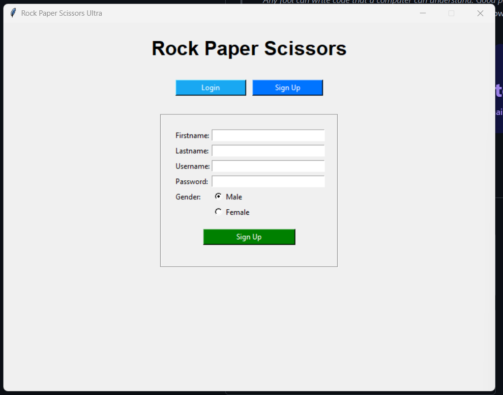 | 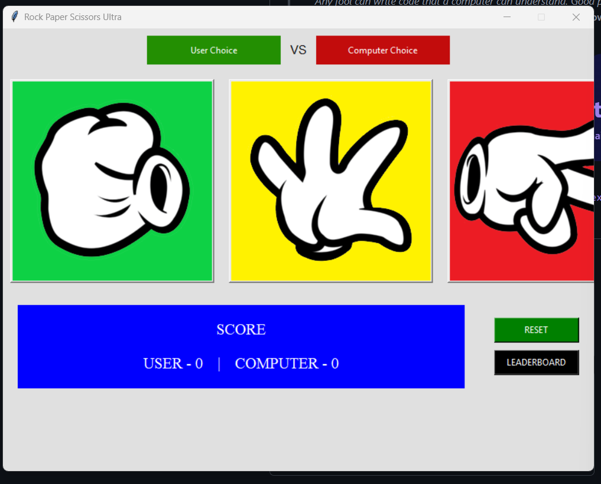 | 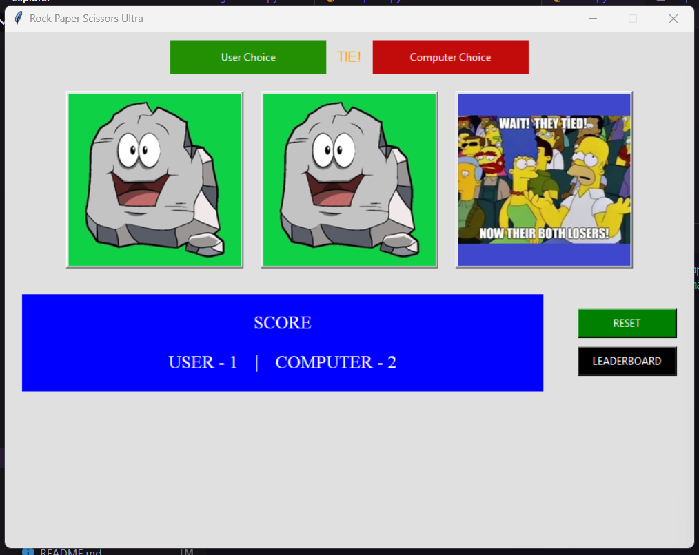 |

| 4. Lose Output | 5. Tied Output | 6. Leaderboard |
|:---:|:---:|:---:|
| 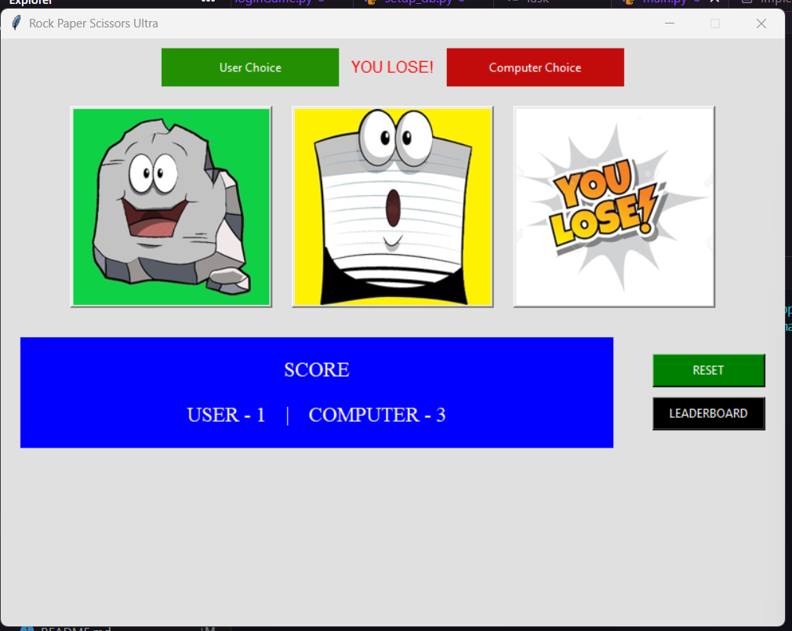 | 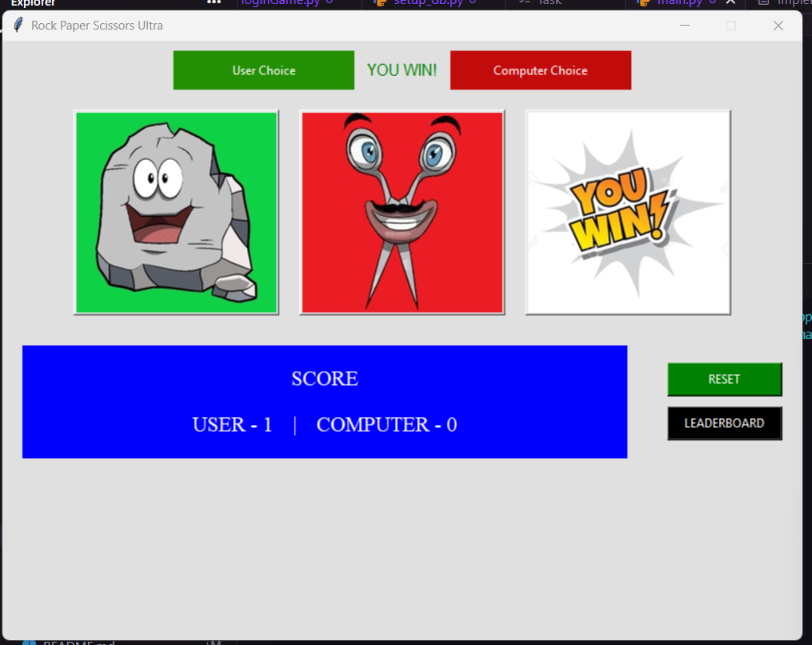 | 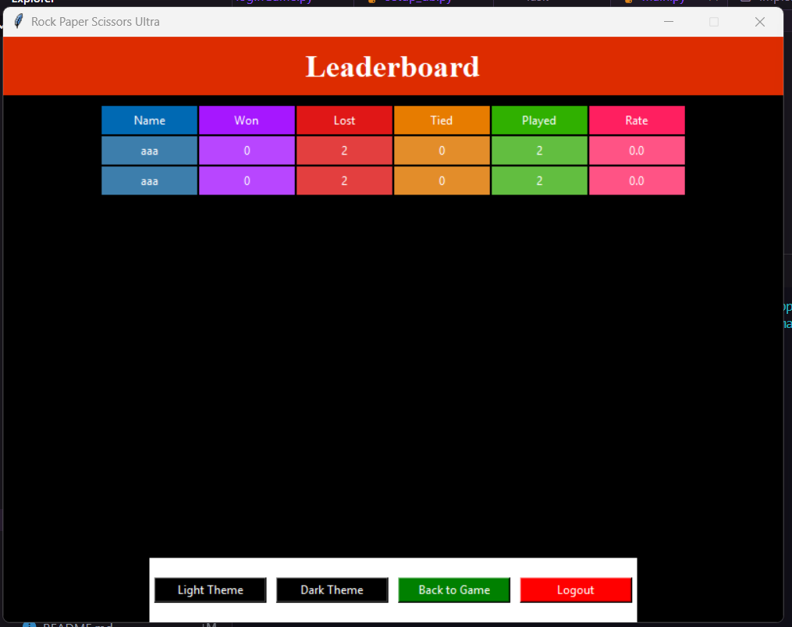 |

---

## ⚙️ Installation & Setup

### Prerequisites

1. 🐍 **Python 3.x** installed
2. 🐘 **PostgreSQL** installed and running

### Steps

1. **Clone the repository:**
   ```bash
   git clone https://github.com/your-username/Rock-Paper-Scissors-Ultra.git
   cd "Rock Paper Scissors"
   ```

2. **Install dependencies:**
   ```bash
   pip install pillow psycopg2
   ```

3. **Database Configuration:**
   Open `db_manager.py` and `setup_db.py` and ensure `DB_CONFIG` matches your local PostgreSQL credentials (default expects password `subh06`, user `postgres`).

4. **Initialize the Database:**
   ```bash
   python setup_db.py
   ```

5. **Start the Game:**
   ```bash
   python main.py
   ```

---

## 🎮 Match Score Flow

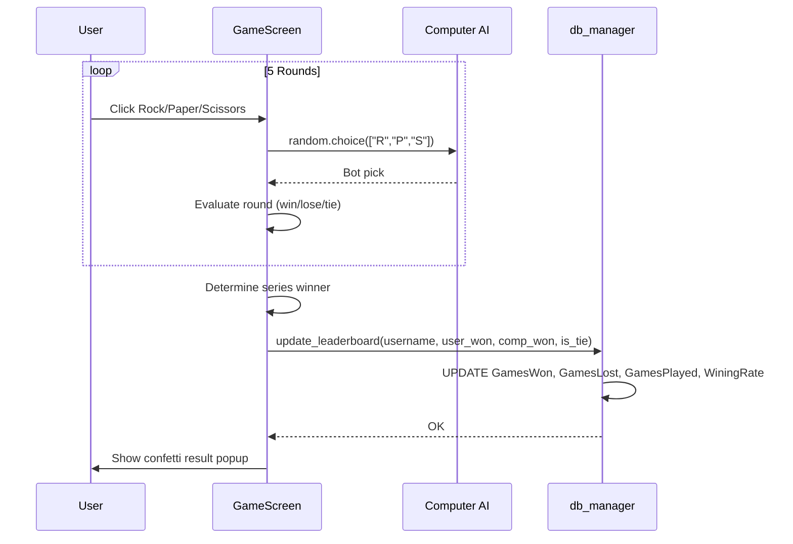
```mermaid
sequenceDiagram
    participant User
    participant Game as GameScreen
    participant Bot as Computer AI
    participant DB as db_manager

    loop 5 Rounds
        User->>Game: Click Rock/Paper/Scissors
        Game->>Bot: random.choice(["R","P","S"])
        Bot-->>Game: Bot pick
        Game->>Game: Evaluate round (win/lose/tie)
    end

    Game->>Game: Determine series winner
    Game->>DB: update_leaderboard(username, user_won, comp_won, is_tie)
    DB->>DB: UPDATE GamesWon, GamesLost, GamesPlayed, WiningRate
    DB-->>Game: OK
    Game->>User: Show confetti result popup
```

---

## 📊 Leaderboard Computation

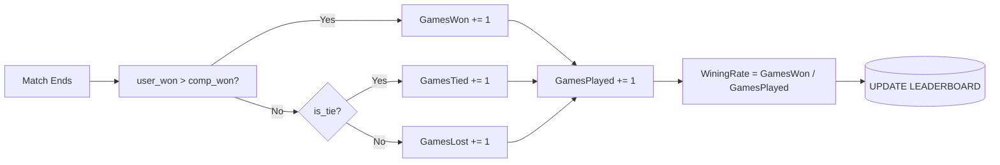
```mermaid
flowchart LR
    A[Match Ends] --> B[user_won > comp_won?]
    B -- "Yes" --> C[GamesWon += 1]
    B -- "No" --> D{is_tie?}
    D -- "Yes" --> E[GamesTied += 1]
    D -- "No" --> F[GamesLost += 1]
    C --> G[GamesPlayed += 1]
    E --> G
    F --> G
    G --> H[WiningRate = GamesWon / GamesPlayed]
    H --> I[(UPDATE LEADERBOARD)]
```

---

## 🚀 Future Improvements

1. 🔒 **Password Hashing:** Implement `bcrypt` before storing credentials for better security
2. 🌱 **Environment Variables:** Move hardcoded credentials to a `.env` file
3. 🌐 **Multiplayer Capabilities:** Add `socketio` or a REST API backend for two real users over a network
4. 🎞 **Enhanced Animations:** Smooth transitions using standard GUI animation loops
5. 🪟 **Modernized UI Framework:** Upgrade to `CustomTkinter` or `PyQt`

---

## 🤝 Contribution

Contributions, issues, and feature requests are always welcome!

1. 🍴 Fork the Project
2. 🌿 Create your Feature Branch (`git checkout -b feature/AmazingFeature`)
3. 💾 Commit your Changes (`git commit -m 'Add some AmazingFeature'`)
4. 📤 Push to the Branch (`git push origin feature/AmazingFeature`)
5. 🔁 Open a Pull Request

---

## 📜 License

Distributed under the MIT License. See `LICENSE` for more information.

---

## 👨‍💻 Author

**Rock Paper Scissors Ultra Project**  
Designed and Developed by **Subh06**

Feel free to reach out with improvements, feedback, or collaborations!

---

<p align="center">
  ✊ ✋ ✌ — May the best hand win.
</p>
