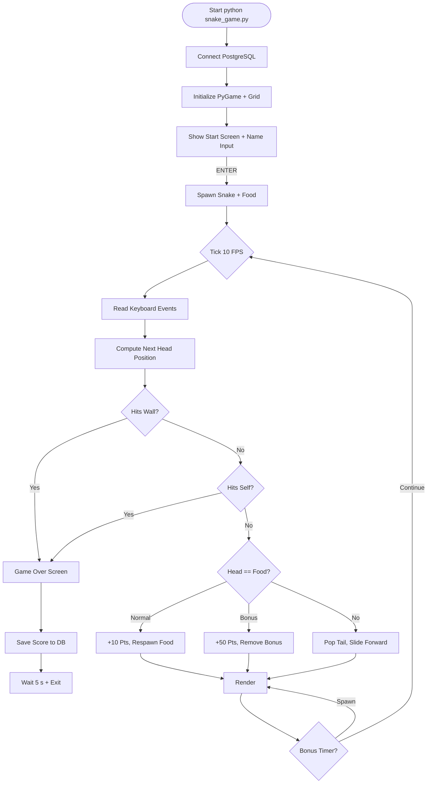
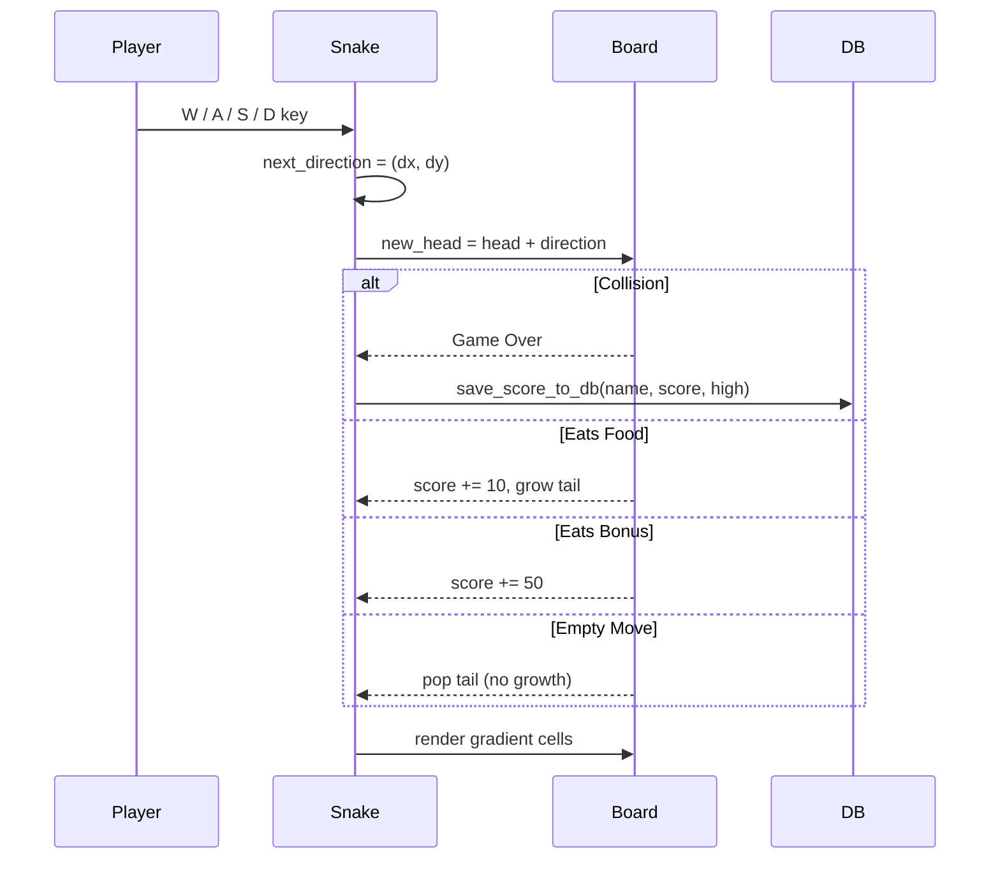
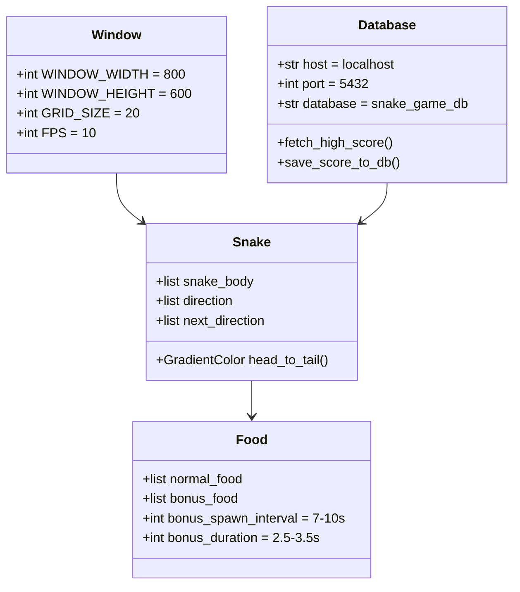
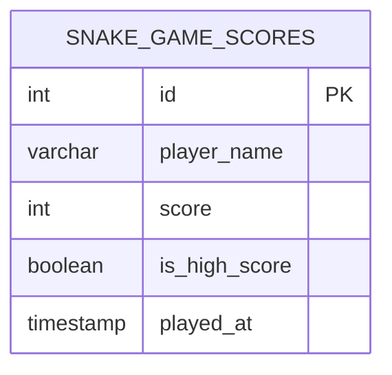
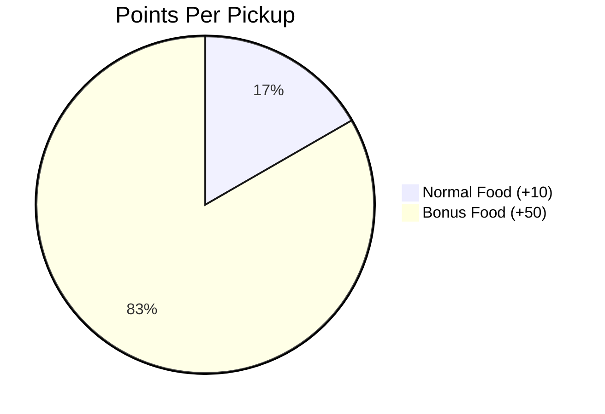
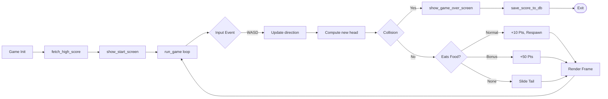

# 🐍 Snake Game (Python)

<p align="center">
  
  
  
  
</p>

A classic **Snake Game** built using **Python and Pygame**, complete with a **PostgreSQL** leaderboard, gradient-shaded snake rendering, normal food, and randomly spawning **bonus food**.

---

## 📌 Project Status

✅ **Complete** — playable end-to-end with persistent high-score storage.

---

## 🎮 Game Description

The player controls a snake that moves around a gridded board.  
The goal is to eat food, grow longer, and avoid colliding with the walls or itself.  
A higher score is rewarded by snagging rare pulsing **gold bonus food** (+50 points).

---

## ✨ Features

- 🐍 Smooth snake movement with **gradient body coloring** (head cyan → tail purple)
- 🍎 Random food generation that never overlaps the snake
- ⭐ Pulsing **gold bonus food** (+50 points, appears every 7–10 s)
- 📈 Real-time score tracking + persistent high-score DB
- 🎨 Polished start screen with player-name input
- 🛑 Wall + self-collision detection
- 💥 Game-over screen with **NEW HIGH SCORE!** celebration

---

## 🕹️ Game Loop



---

## 🐍 Snake Lifecycle



---

## 🎨 Board Visualization

```text
┌──────────────────────────────────────────────────────┐
│  Score: 10                High Score: 240            │
│                                                      │
│   ┌──┐                                                │
│   │  │                                                │
│   │  │   🐍🐍🐍                                       │
│   │  │       🐍        ⭐ (gold bonus, pulsing)       │
│   │  │       🐍🐍                                     │
│   └──┘                                                │
│                                                      │
└──────────────────────────────────────────────────────┘
   Grid: 40 × 30 cells of 20×20 px   →   800 × 600 px
```

---

## 🛠️ Tech Stack

| Layer | Technology |
|-------|------------|
| 🐍 Language | Python 3.x |
| 🎮 Engine | PyGame |
| 💾 Database | PostgreSQL (psycopg2) |
| 📦 Distribution | Standalone `.py` script |

---

## 📂 Project Structure

```text
Snake Game/
│
├── snake_game.py     # 🎮 Full game logic, rendering, DB
├── requirements.txt  # 📦 Pinned dependencies
└── README.md         # 📖 You are here
```

---

## ⚙️ Game Constants



---

## 🗄️ Database Schema



---

## 🎯 Controls

| Action | Key |
|--------|-----|
| ⬆️ Move Up | <kbd>W</kbd> |
| ⬇️ Move Down | <kbd>S</kbd> |
| ⬅️ Move Left | <kbd>A</kbd> |
| ➡️ Move Right | <kbd>D</kbd> |
| ▶️ Start Game | <kbd>Enter</kbd> |
| ⌫ Delete Character | <kbd>Backspace</kbd> |

> The snake cannot directly reverse direction onto itself — input is buffered until the next tick.

---

## 📊 Scoring Rules



| Event | Points |
|-------|:------:|
| 🍎 Eat normal food | **+10** |
| ⭐ Eat bonus food | **+50** |
| 💥 Wall collision | Game Over |
| 💥 Self collision | Game Over |

---

## ▶️ How to Run the Game

### 1️⃣ Install dependencies

```bash
pip install -r requirements.txt
```

### 2️⃣ Configure PostgreSQL

Update the `DB_CONFIG` dictionary in `snake_game.py`:

```python
DB_CONFIG = {
    'host': 'localhost',
    'port': 5432,
    'database': 'snake_game_db',
    'user': 'postgres',
    'password': 'subh06'
}
```

### 3️⃣ Create the table

```sql
CREATE TABLE snake_game_scores (
    id            SERIAL PRIMARY KEY,
    player_name   VARCHAR(50)  NOT NULL,
    score         INT          NOT NULL,
    is_high_score BOOLEAN      DEFAULT FALSE,
    played_at     TIMESTAMP    DEFAULT NOW()
);
```

### 4️⃣ Launch

```bash
python snake_game.py
```

---

## 🧠 Game Architecture



---

## 🚀 Future Improvements

- 🔊 Sound effects (eat / crash / bonus)
- 💾 High-score saving (already implemented — extend to top-10 leaderboard)
- ⏸ Pause / Resume feature
- 🎚 Difficulty levels (speed scaling)
- 🌐 Web export via Pyodide / Pygbag

---

## 👨‍💻 Author

- **Subh** & **Abhishek**

---

<p align="center">
  🐍 A retro classic reimagined with a modern twist.
</p>
