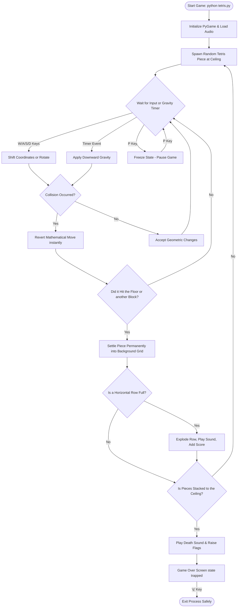

# 🧱 Python PyGame Tetris
A sleek, modern, and highly-commented clone of the classic Tetris game built in Python using the **PyGame** library. 

This project features dynamic procedural audio, 3D glossy block rendering, customizable neon color palettes, and comprehensive per-line documentation designed specifically for beginners learning game development!

---
<p align="center">
  
  
  
</p>

## 🚀 Features
* **Modern Controls**: Play effortlessly using standard `W, A, S, D` gaming keys.
* **Procedural Audio**: No external sound assets are needed! The game synthetically generates its own retro 8-bit audio files (via `generate_sounds.py`).
* **Sleek Graphics**: Pieces are rendered with advanced transparent surface overlays to create satisfying 3D bevels and shadows upon a dark, gridded board.
* **Dynamic Speed**: The game speed actively scales relative to your accumulated score.
* **Pause Functionality**: Pause the game safely at any time.
* **Fully Documented**: Every single line of code in the engine is functionally commented with human-readable explanations.

---

## 📂 Folder Architecture

```text
Tetris Game/
│
├── tetris.py            # Main game engine, event loops, and renderer
├── block.py             # Geometric piece logic, collision tracking, and rendering algorithms
├── constants.py         # Global configuration details (colors, sizes, speeds, scoring thresholds)
├── generate_sounds.py   # Procedural auditory script leveraging Python's `math` and `wave` libs
│
├── move.wav             # (Auto-generated) Pitch envelope for grid movement
├── rotate.wav           # (Auto-generated) Pitch envelope for piece rotation
├── clear.wav            # (Auto-generated) Success chime for completed horizontal lines
└── game_over.wav        # (Auto-generated) Sliding disappointment melody for death states
```

---

## 🗺️ Logical User Flow



---

## ⚙️ How to Use & Play

### Pre-requisites
You will need **Python 3.x** installed locally alongside the **PyGame 2.x** graphic library.
```bash
pip install pygame
```

### Installation & Launching
1. First, navigate to the folder and generate the audio files by running the included script:
   ```bash
   python generate_sounds.py
   ```
2. Once the four `.wav` files compile in the folder, simply execute the main game engine:
   ```bash
   python tetris.py
   ```

### 🎮 Controls
* **W**: Rotate Piece Clockwise
* **A**: Move Piece Left
* **D**: Move Piece Right
* **S**: Accelerate Drop / Move Down
* **P**: Pause / Unpause the game
* **Q**: Quit Application 

---

## 🐙 Forking & Cloning This Repository

Follow these instructions to safely bring a copy of this project down to your local machine for editing or archiving!

**1. Clone the repository directly to your terminal**
```bash
# HTTPS method
git clone https://github.com/Subhadip-Paul2006/Games-Using-Python.git

# Navigate exactly into the Tetris project sub-folder
cd "Games-Using-Python/Tetris Game"
```

**2. Forking for your own Contributions**
If you wish to upload your own improvements to the game, navigate to the GitHub repository page in your browser and click the **Fork** button in the top right corner. 

Clone your newly forked repository down to your machine, make your graphical or engine edits, and push the branch back:
```bash
git commit -am "Added my own cool feature!"
git push
```
## 👨‍💻 Author

**Rock Paper Scissors Ultra Project**

Designed and Developed by **Subh06**

Feel free to reach out with improvements, feedback, or collaborations!
