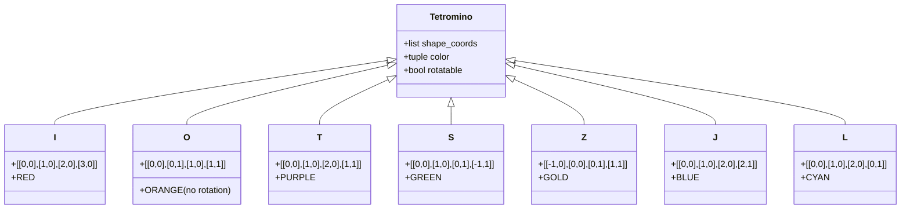
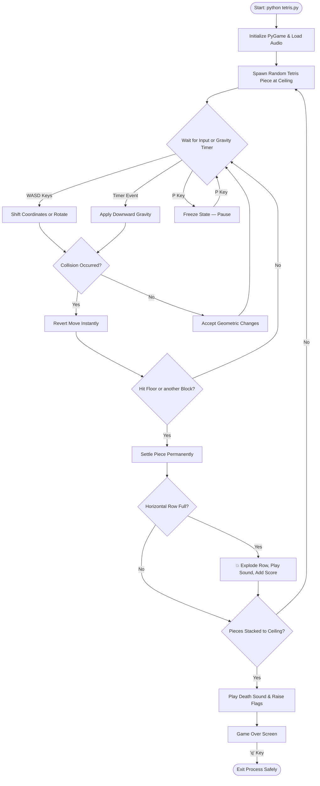
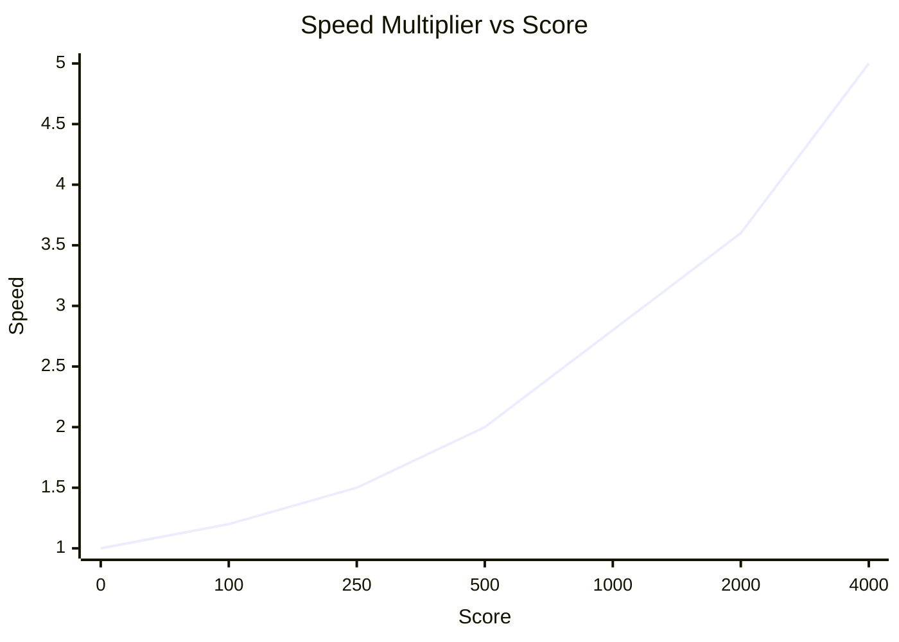
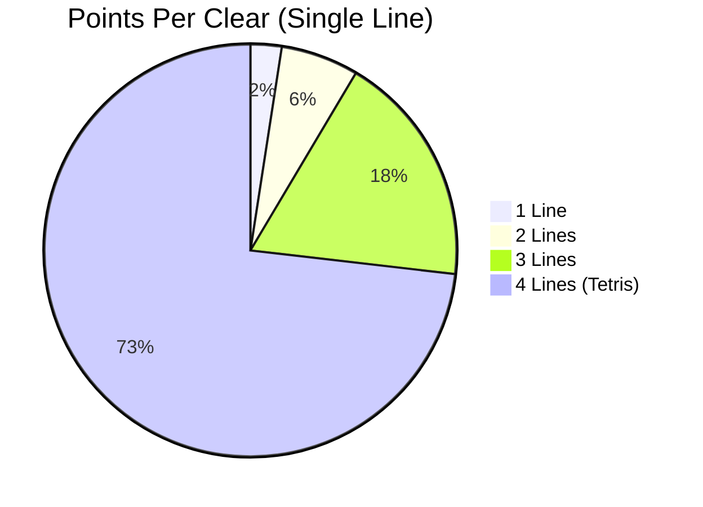
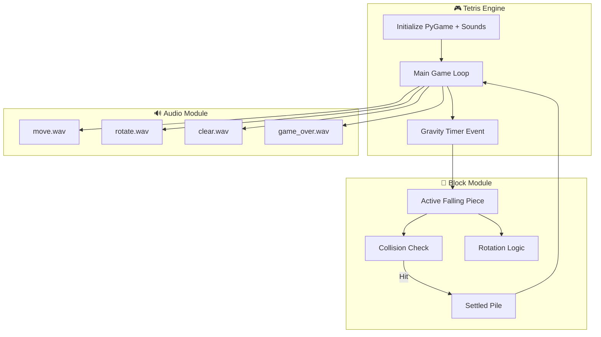
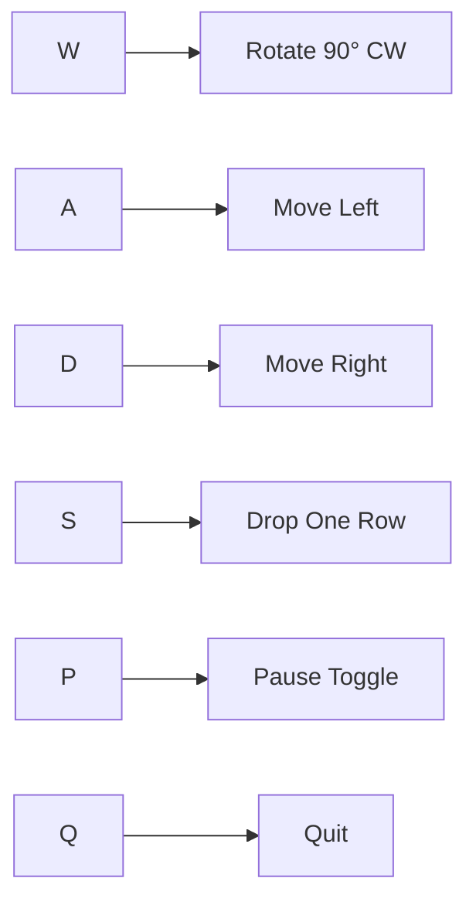
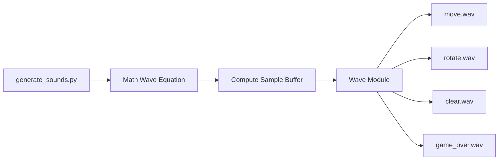
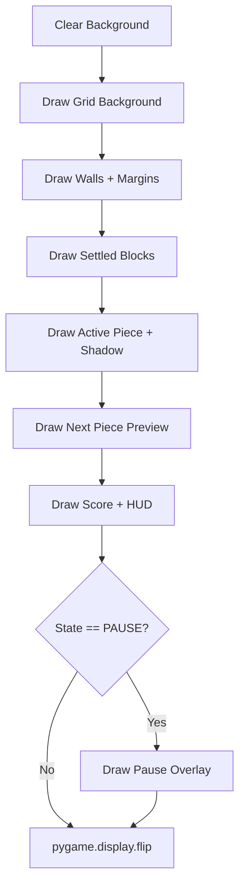
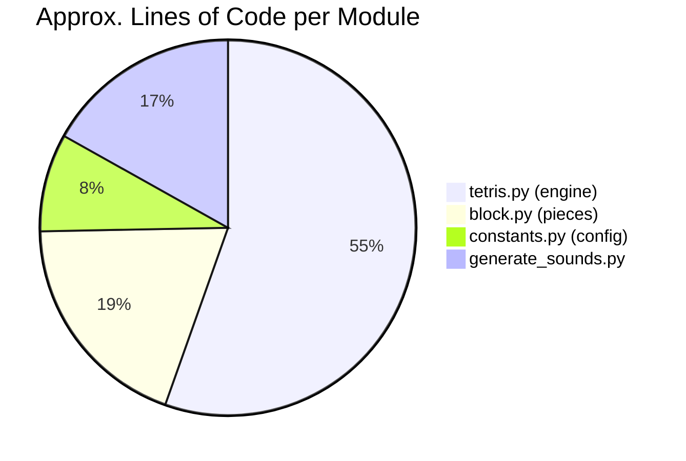

<<<<<<< HEAD
# 🧱 Python PyGame Tetris

<p align="center">
  
  
  
  
  
</p>

A sleek, modern, and **highly-commented** clone of the classic **Tetris** game built in Python using the **PyGame** library.

This project features dynamic **procedural audio**, **3D glossy block rendering**, customizable **neon color palettes**, and comprehensive per-line documentation designed specifically for beginners learning game development.
=======
<h1 align = "center"> 🧱 Python PyGame Tetris</h1>
<h4 align = "center">A sleek, modern, and highly-commented clone of the classic Tetris game built in Python using the **PyGame** library. 

This project features dynamic procedural audio, 3D glossy block rendering, customizable neon color palettes, and comprehensive per-line documentation designed specifically for beginners learning game development!</h4>
>>>>>>> 10c6cd1ab7414573c76a973de62db78ef1919acf

---
<p align="center">
  
  
</p>

## 🚀 Features

- 🕹️ **Modern Controls:** Play effortlessly using standard `W, A, S, D` gaming keys
- 🎵 **Procedural Audio:** No external sound assets needed — the game synthetically generates its own retro 8-bit audio files (via `generate_sounds.py`)
- ✨ **Sleek Graphics:** Pieces rendered with advanced transparent surface overlays to create satisfying 3D bevels and shadows upon a dark, gridded board
- ⚡ **Dynamic Speed:** Game speed actively scales relative to your accumulated score
- ⏸ **Pause Functionality:** Pause the game safely at any time
- 📖 **Fully Documented:** Every single line of code in the engine is functionally commented with human-readable explanations

---

## 🎮 Tetromino Pieces


```mermaid
classDiagram
    class Tetromino {
        +list shape_coords
        +tuple color
        +bool rotatable
    }

    class I {
        +[[0,0],[1,0],[2,0],[3,0]]
        +RED
    }
    class O {
        +[[0,0],[0,1],[1,0],[1,1]]
        +ORANGE (no rotation)
    }
    class T {
        +[[0,0],[1,0],[2,0],[1,1]]
        +PURPLE
    }
    class S {
        +[[0,0],[1,0],[0,1],[-1,1]]
        +GREEN
    }
    class Z {
        +[[-1,0],[0,0],[0,1],[1,1]]
        +GOLD
    }
    class J {
        +[[0,0],[1,0],[2,0],[2,1]]
        +BLUE
    }
    class L {
        +[[0,0],[1,0],[2,0],[0,1]]
        +CYAN
    }

    Tetromino <|-- I
    Tetromino <|-- O
    Tetromino <|-- T
    Tetromino <|-- S
    Tetromino <|-- Z
    Tetromino <|-- J
    Tetromino <|-- L
```

### ASCII Piece Shapes

```text
  I            O           T            S            Z            J            L
 ████        ██ ██       ██ ██         ██ ██         ██ ██        ██ ██        ██ ██
                          ██            ██ ██         ██ ██           ██        ██
```

---

## 🗺️ Logical User Flow


```mermaid
graph TD
    A([Start: python tetris.py]) --> B[Initialize PyGame & Load Audio]
    B --> C[Spawn Random Tetris Piece at Ceiling]

    C --> D{Wait for Input or Gravity Timer}

    D -- "WASD Keys" --> E[Shift Coordinates or Rotate]
    D -- "Timer Event" --> F[Apply Downward Gravity]
    D -- "P Key"     --> G[Freeze State — Pause]

    G -- "P Key" --> D

    E --> H{Collision Occurred?}
    F --> H

    H -- "Yes" --> I[Revert Move Instantly]
    H -- "No"  --> J[Accept Geometric Changes]

    I --> K{Hit Floor or another Block?}
    J --> D

    K -- "Yes" --> L[Settle Piece Permanently]
    K -- "No"  --> D

    L --> M{Horizontal Row Full?}
    M -- "Yes" --> N[💥 Explode Row, Play Sound, Add Score]
    M -- "No"  --> O{Pieces Stacked to Ceiling?}

    N --> O

    O -- "Yes" --> P[Play Death Sound & Raise Flags]
    O -- "No"  --> C

    P --> Q[Game Over Screen]
    Q -- "'q' Key" --> R([Exit Process Safely])
```

---

## 📈 Scoring & Speed Curve


```mermaid
xychart-beta
    title "Speed Multiplier vs Score"
    x-axis "Score" [0, 100, 250, 500, 1000, 2000, 4000]
    y-axis "Speed" 1 --> 5
    line [1, 1.2, 1.5, 2, 2.8, 3.6, 5]
```

| Lines Cleared | Bonus Points |
|:-------------:|:------------:|
| 1 | 40 |
| 2 | 100 |
| 3 | 300 |
| 4 (Tetris!) | 1200 |


```mermaid
pie title Points Per Clear (Single Line)
    "1 Line" : 40
    "2 Lines" : 100
    "3 Lines" : 300
    "4 Lines (Tetris)" : 1200
```

---

## 📂 Folder Architecture

```text
Tetris Game/
│
├── tetris.py            # 🎮 Main game engine, event loops, renderer
├── block.py             # ⚙️ Geometric piece logic, collision, rendering
├── constants.py         # 🔧 Global config (colors, sizes, speeds, scoring)
├── generate_sounds.py   # 🎵 Procedural audio via Python `math` + `wave`
│
├── move.wav             # (Auto-generated) Pitch envelope for grid movement
├── rotate.wav           # (Auto-generated) Pitch envelope for piece rotation
├── clear.wav            # (Auto-generated) Success chime for completed lines
└── game_over.wav        # (Auto-generated) Sliding disappointment melody
```

---

## 🏗️ Engine Architecture


```mermaid
flowchart TB
    subgraph Engine["🎮 Tetris Engine"]
        Init[Initialize PyGame + Sounds]
        Loop[Main Game Loop]
        Timer[Gravity Timer Event]
    end

    subgraph Block["🧱 Block Module"]
        Active[Active Falling Piece]
        Settled[Settled Pile]
        Collide[Collision Check]
        Rotate[Rotation Logic]
    end

    subgraph Audio["🔊 Audio Module"]
        SoundMove[move.wav]
        SoundRotate[rotate.wav]
        SoundClear[clear.wav]
        SoundOver[game_over.wav]
    end

    Init --> Loop
    Loop --> Timer
    Timer --> Active
    Active --> Collide
    Active --> Rotate
    Collide -->|Hit| Settled
    Settled --> Loop
    Loop --> SoundMove
    Loop --> SoundRotate
    Loop --> SoundClear
    Loop --> SoundOver
```

---

## ⚙️ How to Use & Play

### Pre-requisites

You will need **Python 3.x** installed locally alongside the **PyGame 2.x** graphic library.

```bash
pip install pygame
```

### Installation & Launching

1. 📂 Navigate to the folder and generate the audio files:
   ```bash
   python generate_sounds.py
   ```
2. ▶️ Once the four `.wav` files are created, execute the main game engine:
   ```bash
   python tetris.py
   ```

---

## 🎮 Controls

| Action | Key |
|--------|-----|
| 🔄 Rotate Piece Clockwise | <kbd>W</kbd> |
| ⬅️ Move Piece Left | <kbd>A</kbd> |
| ➡️ Move Piece Right | <kbd>D</kbd> |
| ⬇️ Accelerate Drop | <kbd>S</kbd> |
| ⏸ Pause / Unpause | <kbd>P</kbd> |
| ❌ Quit Application | <kbd>Q</kbd> |


```mermaid
flowchart LR
    W[W] --> Rotate[Rotate 90° CW]
    A[A] --> Left[Move Left]
    D[D] --> Right[Move Right]
    S[S] --> Down[Drop One Row]
    P[P] --> Pause[Pause Toggle]
    Q[Q] --> Quit[Quit]
```

---

## 🔊 Procedural Sound Generation


```mermaid
flowchart LR
    A[generate_sounds.py] --> B[Math Wave Equation]
    B --> C[Compute Sample Buffer]
    C --> D[Wave Module]
    D --> E[move.wav]
    D --> F[rotate.wav]
    D --> G[clear.wav]
    D --> H[game_over.wav]
```

```text
y(t) = A · sin(2π · f · t) · e^(-t/τ)     # exponentially damped sine
```

---

## 🪟 Rendering Layers


```mermaid
flowchart TB
    A[Clear Background] --> B[Draw Grid Background]
    B --> C[Draw Walls + Margins]
    C --> D[Draw Settled Blocks]
    D --> E[Draw Active Piece + Shadow]
    E --> F[Draw Next Piece Preview]
    F --> G[Draw Score + HUD]
    G --> H{State == PAUSE?}
    H -- Yes --> I[Draw Pause Overlay]
    H -- No  --> J[pygame.display.flip]
    I --> J
```

---

## 🐙 Forking & Cloning This Repository

Follow these instructions to safely bring a copy of this project down to your local machine for editing or archiving.

**1. Clone the repository directly to your terminal**

```bash
# HTTPS method
git clone https://github.com/Subhadip-Paul2006/Games-Using-Python.git

# Navigate into the Tetris project sub-folder
cd "Games-Using-Python/Tetris Game"
```

**2. Forking for your own Contributions**

If you wish to upload your own improvements, navigate to the GitHub repository page in your browser and click the **Fork** button in the top right corner. Clone your newly forked repository, make your edits, and push the branch back:

```bash
git commit -am "Added my own cool feature!"
git push
```
<<<<<<< HEAD

Submit a Pull Request — your additions might become part of the official game!

---

## 📊 Code Map


```mermaid
pie title Approx. Lines of Code per Module
    "tetris.py (engine)" : 230
    "block.py (pieces)" : 80
    "constants.py (config)" : 35
    "generate_sounds.py" : 70
```

---

*Built originally by Pavel Benáček as open-source software under the GNU General Public License v3.*

---

<p align="center">
  🧱 Block by block, line by line.
</p>
=======
## 👨‍💻 Author

**Rock Paper Scissors Ultra Project**

Designed and Developed by **Subh06**

Feel free to reach out with improvements, feedback, or collaborations!
>>>>>>> 10c6cd1ab7414573c76a973de62db78ef1919acf
