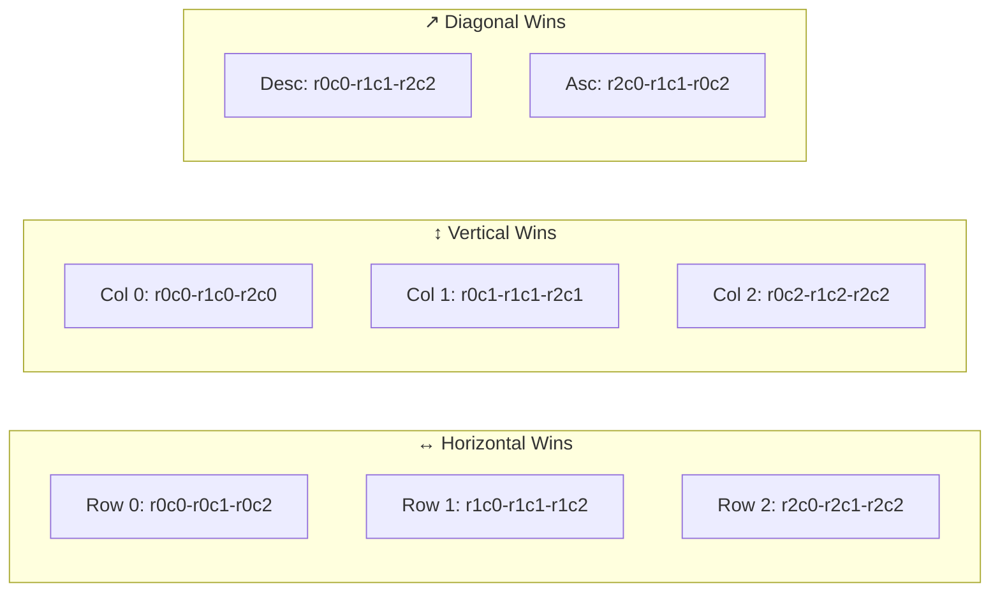
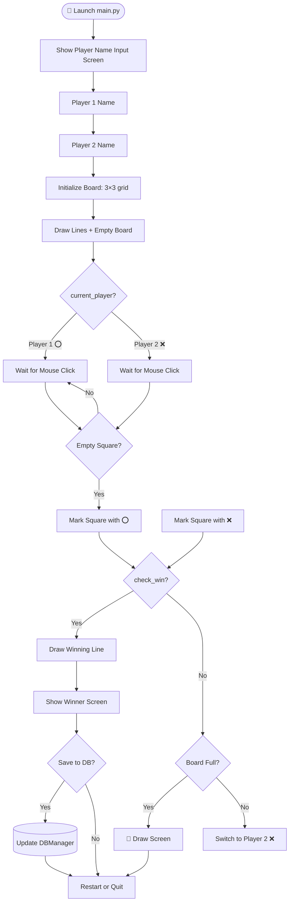
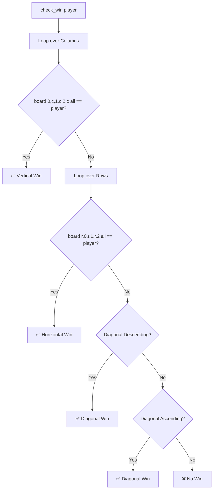
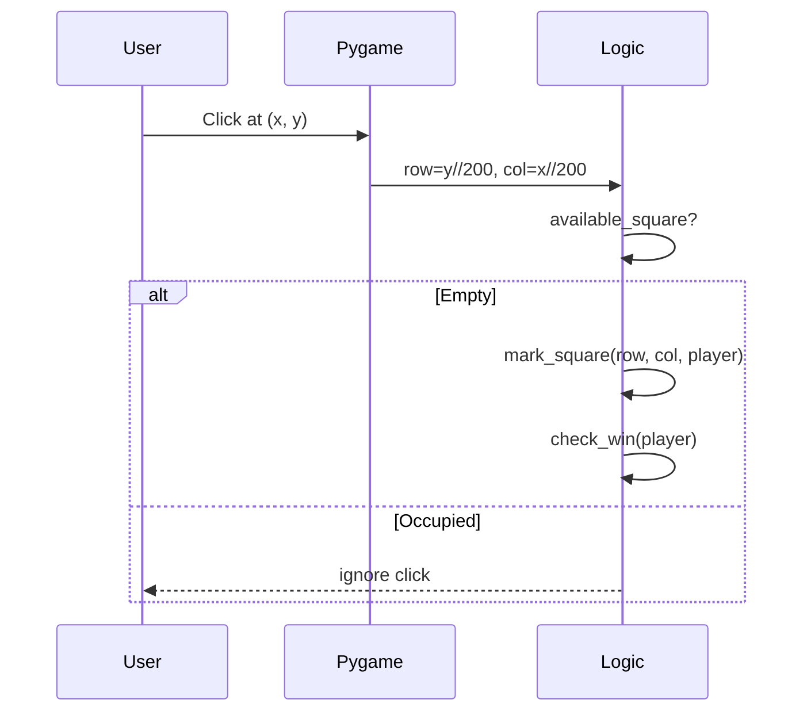
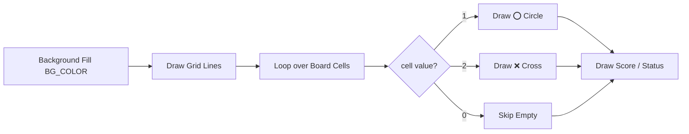
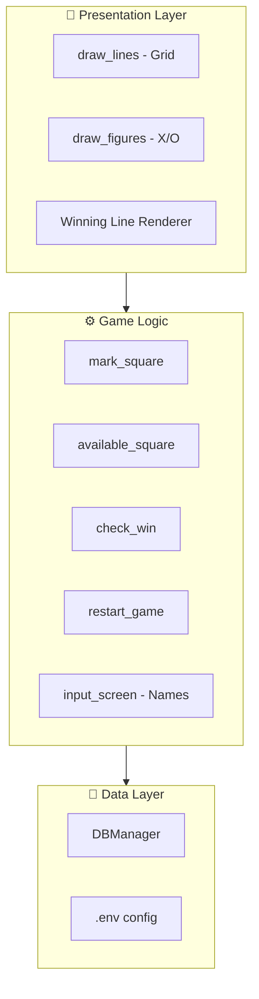
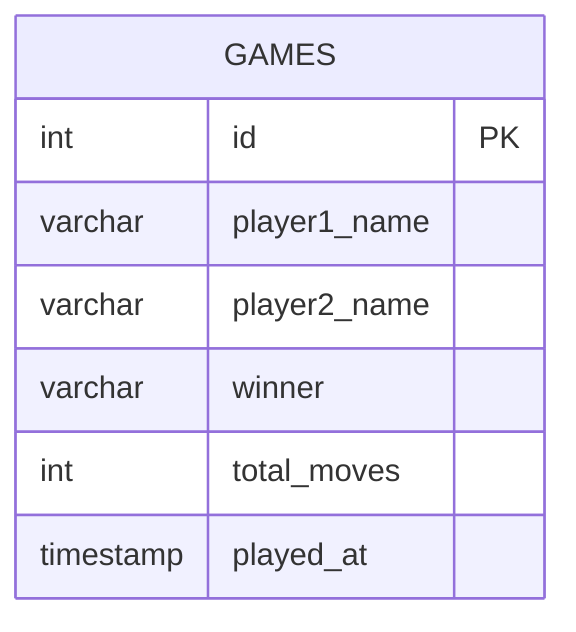
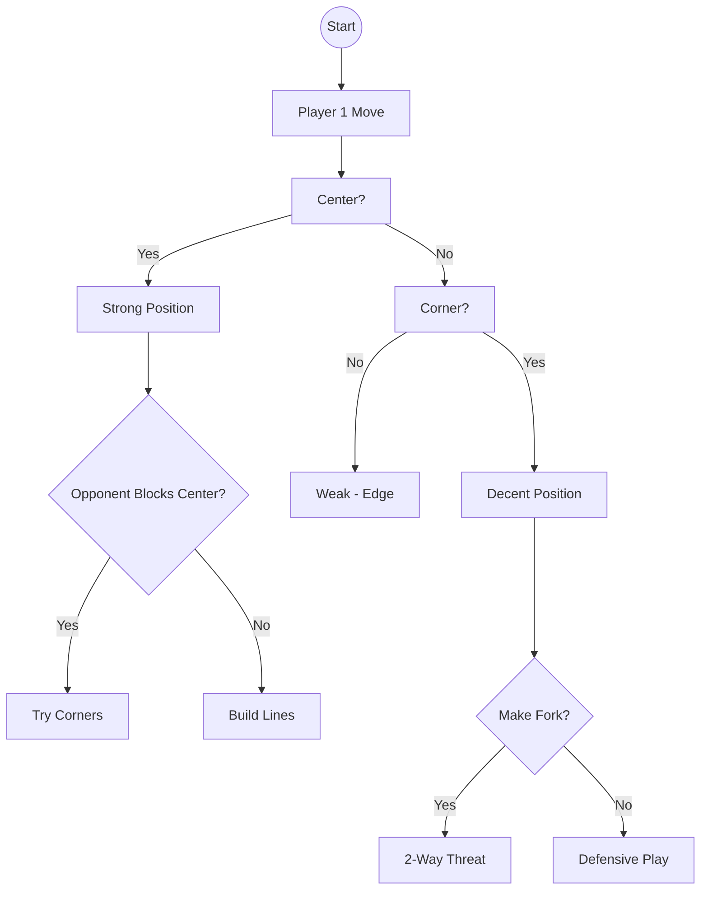

# 🎮 Tic Tac Toe — Single Player (Python + PyGame)

<p align="center">
  
  
  
  
  
</p>

A **Single Player Tic Tac Toe game** built using **Python and PyGame**, with **database integration** for storing game-related data.

---

## 📌 Basic Information

| Property | Value |
|----------|-------|
| 🎲 **Game Name** | Tic Tac Toe |
| 👤 **Mode** | Single Player (vs Computer AI) |
| 🐍 **Language** | Python |
| 🎮 **Framework** | PyGame |
| 💾 **Database** | SQLite / PostgreSQL (configurable via `.env`) |

---

## 🎯 Game Objective

The objective is to align **three identical symbols** before the opponent does:

- ↔️ **Horizontally**
- ↕️ **Vertically**
- ↗️ **Diagonally**

---

## 🏁 The 3×3 Grid — Coordinates

```text
      col 0     col 1     col 2
     ┌─────────┬─────────┬─────────┐
row  │ (0,0)   │ (1,0)   │ (2,0)   │
  0  │   ⭕    │         │   ❌    │
     ├─────────┼─────────┼─────────┤
row  │ (0,1)   │ (1,1)   │ (2,1)   │
  1  │   ❌    │   ⭕    │         │
     ├─────────┼─────────┼─────────┤
row  │ (0,2)   │ (1,2)   │ (2,2)   │
  2  │         │   ❌    │   ⭕    │
     └─────────┴─────────┴─────────┘
```

---

## 🏆 The 8 Winning Patterns



```text
   0   1   2
0  ●───●───●     ← Row 0 win
   │ ╲ │ ╱ │
1  ●───●───●     ← Row 1 win
   │ ╱ │ ╲ │
2  ●───●───●     ← Row 2 win
   ↑   ↑   ↑
   Col  Col  Col
   0    1    2
        ╲ ╱
         ●        ← Diagonals
```

---

## 🔄 Game Flow



---

## 🧠 Win Detection Logic



---

## 🖱 Input → Cell Mapping

```text
Mouse (x, y)
       │
       ▼
   row = y // 200
   col = x // 200
       │
       ▼
  board[row][col] = current_player
```



---

## 🎨 Visual Layers



---

## 🏗️ Module Architecture



---

## 📂 Project Structure

```text
Tic Tac Toe/
│
├── main.py         # 🎮 Game loop, board, rendering, win detection
├── db_manager.py   # 💾 DBManager wrapper for stats persistence
├── db_utils.py     # 🔌 Helpers for query construction
├── .env            # 🔐 Environment variables (DB credentials)
├── requirements.txt# 📦 Pinned dependencies
└── README.md       # 📖 You are here
```

---

## 🗄️ Database Schema



---

## 🎮 Playing Rules

1. 🎲 The game is played on a **3×3 grid**.
2. 🖱 The player clicks on an empty cell to make a move.
3. 🚫 Each cell can be used only once.
4. 🏆 A win is declared if **three symbols align**.
5. 🤝 If all cells are filled and no win is formed → **draw**.
6. 🔁 The game can be **restarted** after completion.

---

## 🛠 Requirements

- 🐍 Python 3.x
- 🎮 PyGame
- 📦 Libraries listed in `requirements.txt`

---

## ▶️ How to Run the Game

### 1️⃣ Install dependencies

```bash
pip install -r requirements.txt
```

### 2️⃣ Configure environment

Create a `.env` file with your DB credentials:

```env
DB_HOST=localhost
DB_PORT=5432
DB_NAME=tic_tac_toe_db
DB_USER=postgres
DB_PASSWORD=your_password
```

### 3️⃣ Launch the game

```bash
python main.py
```

---

## 🗺️ Game Tree — Player 1 Perspective



---

## 🎨 Color Palette

| Token | Color | Hex |
|-------|-------|-----|
| Background | 🟦 Teal | `#1CAA9C` |
| Grid Lines | 🟢 Dark Teal | `#179187` |
| ⭕ Circle | 🟡 Cream | `#EFE7C8` |
| ❌ Cross | ⬛ Dark Grey | `#424242` |
| Win Line | 🟢 Green / 🔴 Red | Dynamic |

---

## 🚀 Future Improvements

- 🌐 Multiplayer over network
- 🤖 Smarter AI (Minimax algorithm)
- 📈 ELO rating system
- 🎞 Animations for X / O placement
- 📱 Mobile / Web export (Pygbag)

---

## 📜 License

This project is part of the **Games-Using-Python** collection under the **MIT License**.

---

<p align="center">
  ⭕ ❌ Three in a row wins it all.
</p>
